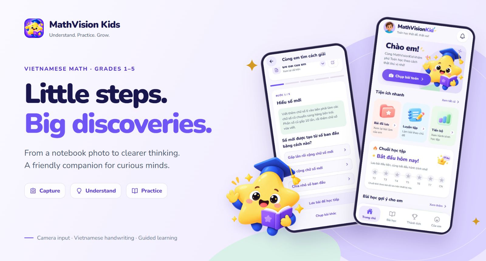
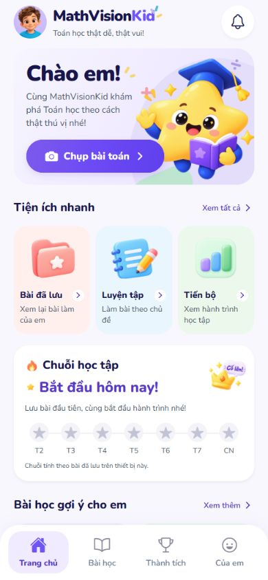
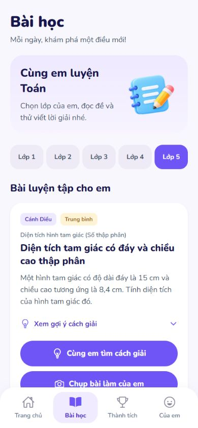
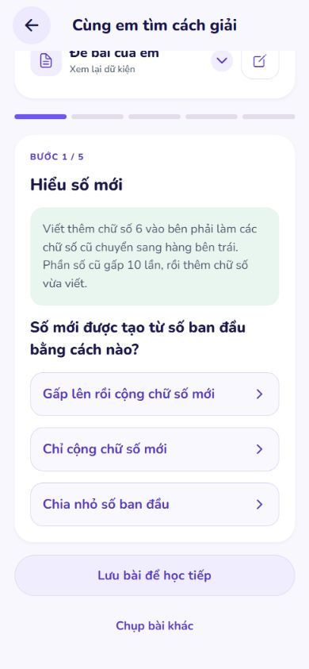
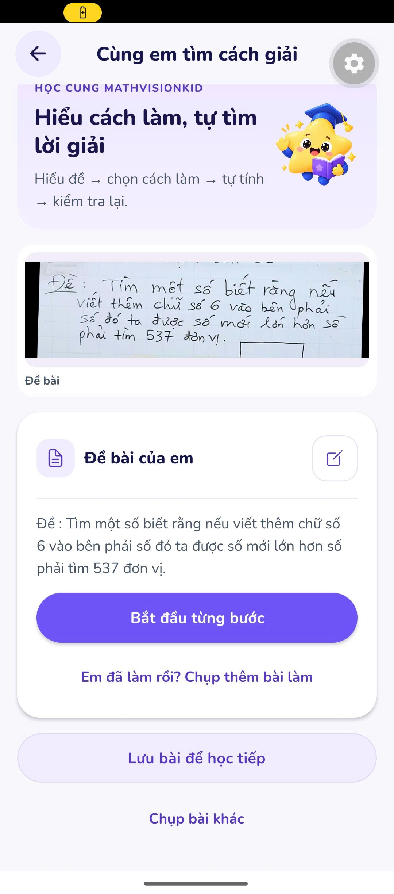
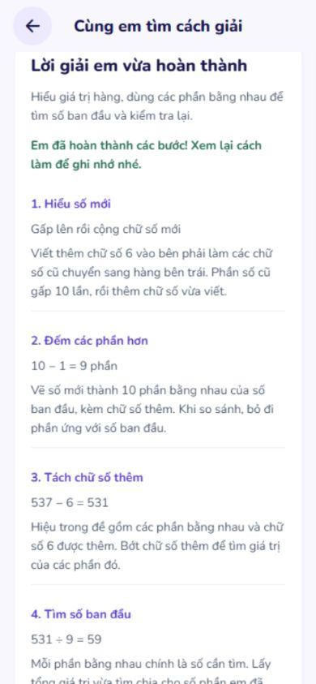

# MathVision Kids

### Turn a notebook photo into a moment of understanding.

A Vietnamese math learning companion for primary school students: capture a problem, review what was read, and learn through small, guided steps.

[Explore the app](#see-it-in-action) · [Get started](#run-it-locally) · [Tiếng Việt](docs/HUONG_DAN_CAI_DAT.md) · [Architecture](docs/ARCHITECTURE_LOCAL_RUNTIME.md) · [Drive data & recovery](DU_LIEU_GOOGLE_DRIVE.md)

---

## A little more confidence, one step at a time

MathVision Kids brings camera input, Vietnamese handwriting recognition, and interactive math guidance into a friendly learning experience. Students can work with a question or their own solution; teachers and administrators have separate web workspaces.

| Capture with care | Understand the work | Learn by doing |
| :--- | :--- | :--- |
| Open the camera directly, straighten and crop the page, and cover personal information before sending. | Review the problem or detected lines, correct uncertain text, and add the original question when only a solution was photographed. | Answer one question at a time, check a calculation, and revisit completed steps instead of just receiving a final answer. |

## See it in action

<table>
  <tr>
    <td align="center" width="33%"> <strong>A welcoming start</strong> One clear action: capture a problem.</td>
    <td align="center" width="33%"> <strong>Practice by grade</strong> Browse activities for grades 1–5.</td>
    <td align="center" width="33%"> <strong>Think through each step</strong> Understand before calculating.</td>
  </tr>
</table>

<strong>More screenshots: a photographed problem, a completed lesson, and learning progress</strong>

<table>
  <tr>
    <td align="center" width="33%"> <strong>Photo → readable problem</strong></td>
    <td align="center" width="33%"> <strong>A solution built together</strong></td>
    <td align="center" width="33%"> <strong>Keep learning</strong></td>
  </tr>
</table>

These are real app screens. Web captures were taken on **5 October 2026** at a mobile viewport; the Android image was supplied by the project owner. Device frames in the cover are presentation artwork. See [screenshot provenance and the demo walkthrough](docs/DEMO_GUIDE.md).

## From photo to learning

~~~mermaid
flowchart LR
    A[Capture or choose a photo] --> B[Straighten and crop]
    B --> C[Cover personal information]
    C --> D[Review the recognized content]
    D --> E{What is in the photo?}
    E -->|Question| F[Start a guided lesson]
    E -->|Worked solution| G[Add the original question]
    G --> F
    F --> H[Try, check, and save]
~~~

An isolated calculation can be checked arithmetically. Deciding whether an entire solution answers the task requires the original question. The app keeps that distinction explicit.

## What is inside

- **Student app:** direct camera access, photo import, crop and rotation controls, privacy masking, editable reading results, guided lessons, saved work, and learning progress.
- **Handwriting tools:** line localization, per-line Vietnamese OCR, review of uncertain readings, and optional cloud assistance.
- **Practice library:** grade-based activities, including topics labeled Kết Nối Tri Thức and Cánh Diều. This is a practice collection, not a claim of full textbook coverage or publisher affiliation.
- **Teacher workspace:** classes, assignments, submission batches, and review workflows.
- **Admin workspace:** role-based management through the business API.

## Run it locally

The supported launcher workflow is **Windows + PowerShell**. Install **Node.js 22.13+**, **Python 3.12**, **JDK 21**, **Git**, and **Docker Desktop with Compose**. Start Docker Desktop before launching the project.

~~~powershell
git clone https://github.com/NV-DuyManh/MathVisionKid.git
cd MathVisionKid
npm ci
py -3.12 -m venv ai\runtime\.venv
.\ai\runtime\.venv\Scripts\python.exe -m pip install --upgrade pip
.\ai\runtime\.venv\Scripts\python.exe -m pip install -r ai\runtime\requirements.txt
.\RUN_MATHVISION.bat
~~~

The launcher starts the local stack, opens the web portal, and displays the student app QR code. **Keep its terminal open to scan the QR code.** The separate student development terminal also remains available.

> **Fresh clone expectations:** source code and model manifests are included; trained weights and API keys are not. The default asynchronous grading mode uses synthetic fixtures. Real handwriting OCR requires the supplied CRNN checkpoint. Reading a photographed math question uses configured cloud vision. Set up those capabilities with the [installation guide](docs/LOCAL_SETUP.md#enable-real-recognition-and-guidance).

| Entry point | Address / command |
| :--- | :--- |
| Unified web portal | `http://localhost:5172` |
| Teacher workspace | `http://localhost:5173` |
| Admin workspace | `http://localhost:5174` |
| Student app | Scan the launcher QR in a compatible Expo Go client |
| Runtime health | `.\scripts\health-check.bat` |
| Stop the local stack | `.\scripts\stop-all.bat` |

For phone setup, development accounts, model files, and configuration, follow [English setup](docs/LOCAL_SETUP.md) or [hướng dẫn tiếng Việt](docs/HUONG_DAN_CAI_DAT.md). For errors, see [troubleshooting](docs/TROUBLESHOOTING.md).

## Technology stack

| Layer | Technologies | Purpose |
| :--- | :--- | :--- |
| Student experience | Expo SDK 57, React Native 0.86, React 19, TypeScript, Expo Router | Mobile navigation, camera input, and shared web preview |
| Image interaction | Expo Camera, Image Picker, Image Manipulator, Gesture Handler, Reanimated | Capture, crop, rotation, and touch feedback |
| Web workspaces | React, TypeScript, Vite | Portal, teacher, and admin interfaces |
| Business API | Java 21, Spring Boot 3.3, Spring Security, JWT, JPA, Flyway | Authentication, authorization, records, and orchestration |
| AI runtime | Python 3.12, FastAPI, Pydantic, PyTorch, OpenCV | Recognition endpoints, image processing, and lesson logic |
| Local recognition | Vietnamese CRNN, optional PP-OCR text detector, YOLO arithmetic detector | Different models for different recognition tasks |
| Cloud assistance | Groq; configurable Gemini fallback | Notebook reading and assistance where enabled |
| Storage and jobs | PostgreSQL 16, MinIO, Redis 7, Celery | Relational records, image storage, and asynchronous processing |
| Verification | Jest, Pytest, JUnit, TypeScript checks | Mobile, AI, and backend regression checks |

Versions above describe the repository, not a recommendation to upgrade independently of its lockfiles.

## How recognition actually works

| Capability | Current implementation | Required for real use |
| :--- | :--- | :--- |
| Locate handwriting lines | Local image geometry; optional text detector assistance | AI runtime; detector artifact if enabled |
| Read individual handwriting lines | Project CRNN checkpoint, with optional cloud advisors | CRNN weights and vocabulary |
| Read a notebook photo in the main math guide | Cloud vision; local geometry helps place the rows | Valid configured Groq or Gemini access |
| Guide a math lesson | Validated built-in plans for supported patterns; cloud-generated plans for other supported requests | Business API + AI runtime; cloud access for generated plans |
| Grade asynchronous arithmetic submissions | Synthetic fixtures by default; YOLO in model mode | YOLO weights for model mode |

Line detection, transcription, and reasoning are separate tasks. A successful health check or an error-free batch does **not** prove that every line or answer is correct. Difficult handwriting, skew, clutter, and incomplete questions still require review. See the [recognition refinement report](report/DRIVE_LINE_REFINEMENT_20261005.md) and [quality notes](docs/ARCHITECTURE_LOCAL_RUNTIME.md#quality-and-current-limits).

## Project map

~~~text
MathVisionKid/
├── apps/                 student-mobile, portal-web, teacher-web, admin-web
├── backend/business-api/ Java / Spring Boot authority
├── ai/runtime/           Python recognition and tutoring services
├── packages/             Shared types and brand resources
├── contracts/            API contracts
├── infra/docker/         Local infrastructure
├── scripts/              Launch, health, and stop commands
├── docs/                 Setup, usage, architecture, and demo media
└── report/               Dated implementation and validation reports
~~~

## Documentation

| I want to… | Read this |
| :--- | :--- |
| Install and run the project | [Local setup](docs/LOCAL_SETUP.md) · [Tiếng Việt](docs/HUONG_DAN_CAI_DAT.md) |
| Understand how a student uses it | [User guide](docs/USER_GUIDE.md) |
| Present the app and view all demo images | [Demo walkthrough](docs/DEMO_GUIDE.md) |
| Understand services and AI boundaries | [Architecture](docs/ARCHITECTURE_LOCAL_RUNTIME.md) |
| Fix startup, phone, or recognition issues | [Troubleshooting](docs/TROUBLESHOOTING.md) |
| Review labels and evaluate a local OCR candidate | [OCR review and training](docs/OCR_REVIEW_AND_TRAINING.md) |
| Check the latest app on a physical phone | [Phone test checklist](docs/PHONE_TEST_HANDOFF.md) |
| Contribute and run checks | [Contributing](CONTRIBUTING.md) |

## Contributing and license

Focused improvements, reproducible bug reports, and carefully reviewed recognition examples are welcome. Start with [CONTRIBUTING.md](CONTRIBUTING.md). Keep credentials, student photos, datasets, checkpoints, and runtime logs out of Git.

The repository includes an [MIT license](LICENSE). Retain existing copyright notices and third-party licenses, including the bundled [Nunito font license](apps/student-mobile/assets/fonts/OFL.txt).

**Understand the problem. Try a small step. Grow a little more confident.**

[Back to top](#mathvision-kids)

