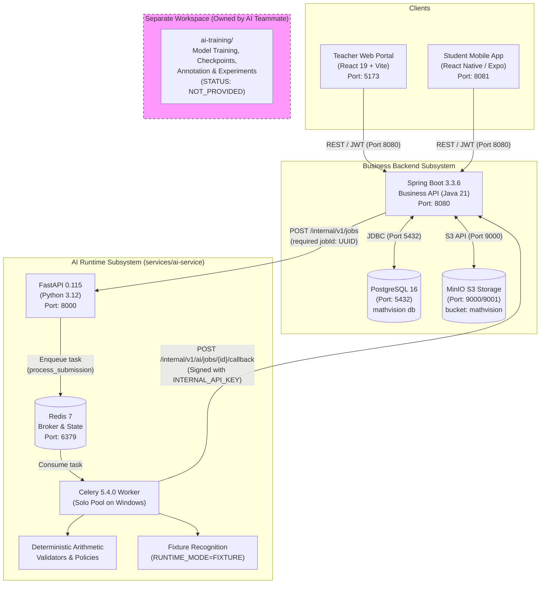

# MathVision Kids -- Local Runtime Architecture

This document describes the runtime topology, component boundaries, and asynchronous data flows across the MathVision Kids system in the local development environment.

---

## 1. System Topology & Architecture Diagram



---

## 2. Component Boundaries & Responsibilities

### Clients
- **Teacher Web Portal:** React 19 single-page application for teachers. Manages classes, assignments, batch uploads (10–30 image packs), privacy verification/masking, and review-by-exception grading.
- **Student Mobile App:** Expo React Native application for primary school students. Supports capturing handwritten math exercises and interactive step-by-step tutoring hints.

### Business Backend Subsystem (`services/business-api`)
- **Spring Boot 3.3.6:** Canonical authority of users, classrooms, assignments, batches, and submissions.
- **Canonical Job Ownership:** Spring Boot creates and persists `AiJob` records with a canonical UUID `jobId` before dispatching async analysis requests.
- **PostgreSQL 16:** Relational database storing relational entities, audit logs, and JSONB diagnostic artifacts.
- **MinIO S3:** Object storage storing raw and privacy-sanitized student submission images in private bucket `mathvision`.

### AI Runtime Subsystem (`services/ai-service`)
- **FastAPI 0.115:** Lightweight, high-performance async job ingestion gateway. Requires `jobId: UUID` and validates contracts.
- **Redis 7:** Celery broker maintaining task queues and correlation states.
- **Celery 5.4.0:** Background worker executing computer vision and validation tasks. Runs with `--pool=solo` on Windows.
- **Fixture Recognition Engine:** Emulates computer vision tokenization for known test cases deterministically while the real model artifact is in training.
- **Deterministic Validators:** Pure Python mathematical engines verifying column-by-column vertical addition and subtraction with strict carry/borrow tracking.
- **Spring Callback Gateway:** Dispatches authenticated HMAC callbacks back to Spring Boot upon task completion.

### External AI Training Boundary (`ai-training/`)
- **Ownership:** Exclusively owned by the AI/ML teammate.
- **Isolation:** Contains training scripts, synthetic datasets, YOLO/CRNN training experiments, and checkpoints.
- **Model Ingestion Contract:** When ready, the trained model artifact and its manifest will be consumed by `ModelRecognitionEngine` in `services/ai-service` without requiring redesign of Spring Boot or frontend clients.

---

## 3. Asynchronous Job Correlation Lifecycle

```
1. Spring Boot creates Submission and commits AiJob (Canonical jobId: UUID)
       │
       ▼
2. Spring HttpAiAnalysisGateway sends POST /internal/v1/jobs { jobId, submissionId, ... }
       │
       ▼
3. FastAPI validates required jobId: UUID and returns HTTP 202 Accepted { jobId, status: "QUEUED" }
       │
       ▼
4. FastAPI enqueues process_submission.delay(job_id, payload) into Redis
       │
       ▼
5. Celery worker dequeues task, binds correlation logging context: [jobId, submissionId]
       │
       ▼
6. Celery executes Quality Gate -> Recognition Engine -> Structured Parser -> Math Validator -> Policy
       │
       ▼
7. Celery sends HTTP POST to Spring Boot: /internal/v1/ai/jobs/{jobId}/callback
       │
       ▼
8. Spring Boot verifies INTERNAL_API_KEY, updates AiJob to COMPLETED, and persists AnalysisResult
```
