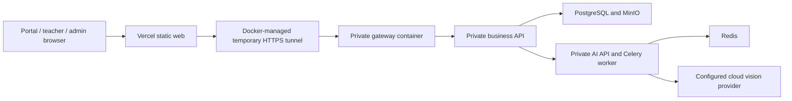

# Vercel web + API/OCR on your PC

This is the owner's selected trial arrangement: the three web workspaces are published on Vercel, while the business API, recognition models, worker, and private data stay in the healthy `mathvision-pc-preview` Docker project on the owner's PC. The portal now also publishes the original student learning interface at `/study/`; web adapters reuse its screens while preserving existing native implementations and default native configuration.

**Keep the PC awake, Docker running, internet connected, and the tunnel running while testing.** The Vercel pages can remain available when the PC is off, but login, server records, uploads, and OCR cannot reach a stopped API.

| Web app | Published address |
| --- | --- |
| Portal | [mathvisionkid-portal.vercel.app](https://mathvisionkid-portal.vercel.app) |
| Student learning interface | [Portal `/study/`](https://mathvisionkid-portal.vercel.app/study/) after student login |
| Teacher | [mathvisionkid-teacher.vercel.app](https://mathvisionkid-teacher.vercel.app) |
| Admin | [mathvisionkid-admin.vercel.app](https://mathvisionkid-admin.vercel.app) |

The deployment and current runtime startup succeeded on 9 October 2026. Student login/page/logout, teacher portal-to-workspace SSO/dashboard/logout, and admin SSO/dashboard/stable logout passed in the public browser after the fixes and redeployment. Admin logout reaches the portal's logged-out screen; reopening login and signing in as a student reached the student page with the new profile, without returning to admin. Final OCR text remains unverified on the tested division image. See [the dated report](../report/cloud-deployment-readiness-2026-10-09.md).

## Resume on the configured owner PC

Start Docker Desktop, then double-click **`RUN_MATHVISION.bat`**. After checking local services and starting Expo, the launcher automatically calls `Start-PC-Preview.ps1 -PublishWeb` when this checkout has an existing `infra/local-runtime/pc-preview/.env.preview`. It reports public startup separately, so a failed publication does not stop the local services. A fresh clone without private preview configuration skips this step; complete first-time setup below before expecting the public API to work.

To start only the public preview, open PowerShell at the repository root and run:

```powershell
powershell -NoProfile -ExecutionPolicy Bypass -File .\scripts\deploy\Start-PC-Preview.ps1 -PublishWeb
```

The script keeps existing accounts, service secrets, model files, and uploaded data. It waits for the isolated containers and reads the tunnel hostname from logs produced since the current container start. If that connection cannot reach the public API, it restarts only this project's tunnel service. Tunnels use HTTP/2 over IPv4 to avoid the UDP/IPv6 failures observed on this PC. Public health probes allow a bounded wait; a hostname appearing in a log alone is insufficient. Only after readiness succeeds does the script rebuild and publish all three web apps for the current HTTPS upstream.

The tunnel is a Docker Compose service using the official Cloudflare image, pinned to release `2026.10.0` and its multi-platform manifest digest. Docker manages it with `restart: unless-stopped`, so closing RUN or its shell does not terminate the connection. Keep the PC awake, Docker running and internet connected. A fresh setup pulls this small image; no separate Windows Cloudflare executable is required.

The publisher checks the public API health before building, runs each app's configuration and production bundle checks, and deploys only its static output to team `manh15`. It needs the Vercel CLI to remain authenticated with access to these projects. Run `vercel whoami` and `vercel teams ls` if authorization fails.

Each browser application calls its own stable Vercel origin at `/api/v1`. The publisher adds a restricted proxy for that path to the current tunnel upstream and disables API response caching. The student export clears the bundler cache and verifies this stable API base before upload. After changing the tunnel hostname, publication updates Vercel's upstream routing. Reload once if your tab still contains a bundle from before this migration.

Portal publication also exports the shared student app, checks its namespace/API configuration, and merges its static output under `/study/`. A student signing in at the portal is sent into that interface after backend role validation; it is no longer a separate phone-only landing page. The actual image-reading/tutor browser flow passed on one division photo with required human confirmation. Confirmed student logout and protected reentry also passed. See [the student web parity report](../report/student-web-parity-2026-10-09.md) for the exact evidence and limits.

To stop this trial and retain its database/images:

```powershell
powershell -NoProfile -ExecutionPolicy Bypass -File .\scripts\deploy\Stop-PC-Preview.ps1
```

The stop script runs `docker compose down` only for `mathvision-pc-preview`, including its managed tunnel. For an older saved Windows tunnel, it validates the executable, target URL and creation time before stopping that process. It does not remove named volumes or stop unrelated Docker projects/processes.

## What connects to what



The outbound tunnel reaches `gateway:8080` within this project's Docker network. Local health checks use the gateway's separate loopback binding. No router port forwarding is required. Vercel proxies only `/api/v1/*`; the gateway permits that path and `/actuator/health` and rejects other paths, including `/internal/*`. Backend authentication and role checks still apply.

The persistent trial uses its own Compose project, production profiles, independent generated secrets, an owner-provisioned administrator, and named data volumes. The ordinary local development stack and seeded development credentials are separate.

## Before the first public test

Follow [the production guide](PRODUCTION_DEPLOYMENT.md) to prepare the three Vercel project origins, public build values, private runtime configuration, verified model bundle, and initial owner account.

The base `infra/production/compose.yml` gateway is designed for a server with an owned domain and publishes ports 80/443. [compose.pc-preview.yml](../infra/production/compose.pc-preview.yml) replaces those publications with **`127.0.0.1:18081:8080`** and selects [Caddyfile.pc-preview](../infra/production/Caddyfile.pc-preview). The backend, AI API, PostgreSQL, Redis, and MinIO remain private.

Private state is stored in the ignored `infra/local-runtime/pc-preview/` directory. The start script restricts this directory to the Windows owner and SYSTEM before initialization.

| Private state | Purpose |
| --- | --- |
| `.env.preview` | Generated independent service secrets and intended provider configuration |
| `owner-credentials.json` | Initial owner login details; kept private and never printed by the script |
| `models/` | Verified eight-file runtime bundle, mounted read-only |
| `tunnel.json` | Current container identity, start time and tunnel hostname |
| `web-deployments.json`, `web-staging/` | Latest deployment record and tested static output |

The owner credential file records the initial password. A later password change does not update that file and does not block ordinary restarts. Use the account's current password for login.

Docker retains the tunnel logs, limited to three files of 10 MB each. Read them with the same project name, environment file and Compose files used by `Start-PC-Preview.ps1`. The current official image and digest are recorded in [compose.pc-preview.yml](../infra/production/compose.pc-preview.yml); update those together when changing the release. See [the official Cloudflare container](https://hub.docker.com/r/cloudflare/cloudflared).

Cloning this repository does not copy the owner's private configuration, accounts, database, cloud credentials or running server. Read [clone and shared-hosting behavior](CLONE_AND_HOSTING.md) before preparing another computer. This owner-specific publisher targets the existing MANH projects; other developers should configure their own deployment rather than repoint the shared website at a new empty database.

On a fresh clone, prepare the normal Python 3.12 AI environment, authenticated Vercel CLI, runtime model bundle, and intended private provider settings first. Initialization reads `ai/runtime/.env`, then `ai/runtime/.env.local` as an override; it copies only the listed provider settings and generates new service secrets. Both source files remain private. The default source model directory is `ai/runtime/.container-smoke-models`; recover the authorized eight-file bundle there before first initialization, or initialize it using `init_pc_preview.py --models <authorized-bundle-directory> --owner-email <owner-email>`.

The start script uses `--no-build` so normal restarts do not rebuild large containers. A new computer needs these production image tags built first:

```powershell
docker build --tag mathvision-ai:production ai/runtime
docker build --tag mathvision-business-api:production backend/business-api
```

For first initialization only, provide your actual owner email:

```powershell
powershell -NoProfile -ExecutionPolicy Bypass -File .\scripts\deploy\Start-PC-Preview.ps1 -OwnerEmail 'you@your-domain.com' -PublishWeb
```

Replace the example email with your own. The script verifies the newly provisioned owner login and `ADMIN` role, then disables bootstrap and removes the bootstrap email/password from the service environment before restarting the backend. Existing configuration is validated and preserved; later starts do not need `-OwnerEmail` or the original source bundle. Missing required private inputs cause a stop without silently switching to fixtures or regenerating existing secrets.

## Start or resume testing

The `Start-PC-Preview.ps1 -PublishWeb` command automates startup, tunnel selection, build checks, and web publication. The sequence below describes the underlying operations for diagnosis or manual operation:

1. Start Docker Desktop and the dedicated PC trial Compose project. Wait for the backend, AI API, worker, and storage services to become healthy.
2. Test the loopback gateway first. `/actuator/health` must return status only; `/internal/v1/ai/jobs` must be inaccessible through the gateway.
3. Start the project's `cloudflared` Compose service against `http://gateway:8080`. The supplied script reads only its current-start logs and records the resulting container identity. Avoid starting another manual tunnel while the managed one is active.
4. Copy the HTTPS `trycloudflare.com` origin printed for the current tunnel. Test its health endpoint and verify that internal paths remain blocked.
5. Build each web app with its own stable Vercel origin plus `/api/v1`; keep the stable cross-app origins. Set the student export API base to the portal's stable `/api/v1` address.
6. Add Vercel's restricted `/api/v1/*` proxy to the current upstream, then publish all three projects. The supplied publisher automates both steps. Changing an environment variable alone does not change an already-built application or its deployed routing.
7. Test real login, SSO, an image upload, the worker result, and private image access through the public web apps. Review OCR text against the source photo.

To rebuild/publish web only while a healthy tunnel is already running, use its current origin:

```powershell
powershell -NoProfile -ExecutionPolicy Bypass -File .\scripts\deploy\Publish-Vercel-Web.ps1 -ApiOrigin 'https://CURRENT-HOSTNAME.trycloudflare.com'
```

Replace the example hostname with the current `Public API origin` printed by the start script. The publisher expects the upstream origin without `/api/v1`; browser builds use each application's stable Vercel `/api/v1` address.

For a portal/student-only update with the **same currently healthy API origin**, add `-Apps portal`. This builds and publishes both the portal and student `/study/` export while retaining the teacher/admin entries in the private deployment record. If the API tunnel hostname changed, publish all three apps instead so none keep the old address.

Cloudflare Quick Tunnels generate a temporary hostname and are intended for testing. They have no uptime guarantee and currently limit in-flight requests to 200; server-sent events are unsupported. See [Cloudflare Quick Tunnels](https://developers.cloudflare.com/tunnel/get-started/quick-tunnels/). This trial uses ordinary API requests and job polling rather than relying on an always-on tunnel.

## After restarting the PC

A restarted Quick Tunnel can have a different hostname. Docker's restart policy alone does not update Vercel's upstream routing. Open **`RUN_MATHVISION.bat`** on the configured PC, or run **`Start-PC-Preview.ps1 -PublishWeb`** to resume only the public trial and republish for the current upstream. A healthy running container is reused. Without `-PublishWeb`, the script prints the current origin but does not update the deployed proxy.

The web origins remain stable, so the backend's CORS allowlist still contains those three web origins. CORS lists the browser applications, not the tunnel hostname. An additional Vercel preview URL must be explicitly allowed before it can use this API.

The dedicated database and uploaded images persist in Docker named volumes. Stop this project's containers without deleting those volumes when pausing testing. Do not kill unrelated terminals, runtimes or Docker projects.

## Common symptoms

| Symptom | Check |
| --- | --- |
| Web opens, login fails | PC awake; Docker/backend healthy; tunnel reachable; published proxy targets the current upstream; correct current account password |
| Tunnel container cannot start | Docker can pull the pinned official image; inspect this project's tunnel service logs |
| Login stops working after sleep, a reboot, or lost Internet | Open `RUN_MATHVISION.bat` again; it checks public readiness, replaces an unusable owned tunnel, and republishes the web apps for the current address |
| Old tunnel address appears in browser requests | Reload once to load the new stable Vercel API bundle; rerun publication if the upstream changed |
| Browser reports CORS rejection | Exact deployed web origin is present in `CORS_ALLOWED_ORIGINS`, without a trailing slash |
| Login works but teacher workspace rejects access | The account has the teacher role; backend remains the authority |
| An image upload stays processing | Redis, AI model readiness, active worker, and private callback connectivity |
| Main photographed question is unreadable/unavailable | Intended cloud vision provider is enabled, configured, and reachable; local model readiness alone is insufficient |
| Internal routes are accessible through the tunnel | Stop the public tunnel and correct the gateway allowlist before resuming |
| Startup reports port 18081 occupied | Another service owns the port; it was not stopped automatically. Resolve that conflict before resuming this preview |
| Bootstrap verification fails | Private bootstrap state is retained for recovery; check backend readiness and the owner credential file without sharing its contents |
| Vercel publication fails | Confirm CLI identity/team access, public API health, and reported app checks; a failed publish does not replace the previously deployed version of that app |

## Availability and release status

All three Vercel deployments were republished on 10 October 2026 with the Docker-managed connection and stable browser API addresses. The earlier Windows-process connection subsequently disappeared and returned Cloudflare 530/1033, despite an earlier successful login check. The current recovery and post-launcher verification are recorded in [the login recovery report](../report/public-login-container-proxy-recovery-2026-10-10.md). Use the start script's current result after any restart; a Quick Tunnel hostname is temporary.

The owner also requested trial accounts, which were provisioned separately and checked for login, identity, and role boundaries. Their passwords are not documented in Git. Public-browser student login/page/logout, teacher SSO/dashboard/logout, and admin SSO/dashboard/stable logout passed. The dashboard checks used actual backend data. These results and the unresolved final OCR text are recorded in [the dated readiness report](../report/cloud-deployment-readiness-2026-10-09.md).

The earlier public per-line OCR test detected five lines from the owner's division photo, saved a test trial, and retrieved real Groq/Gemini responses. Both providers returned identical numeric suggestions matching the photographed rows. Its recorded final text remained inaccurate, low-confidence `CRNN_RAW`, with `correctionSource=NONE` and verdict `UNVERIFIED`; those suggestions were not automatically promoted into final text or labels. The later student website's structured inspect/tutor flow correctly read that one division photo and required the student to confirm it. These are distinct endpoint results; neither establishes accuracy for every photo or a passed arithmetic grade.

For an API that works while the PC is off, use a provisioned persistent server or another approved hosting service with durable storage. A named Cloudflare tunnel with an owned domain can stabilize an API address, but still requires the PC to remain available when the API runs there. It does not turn the PC into a 24/7 cloud server.
