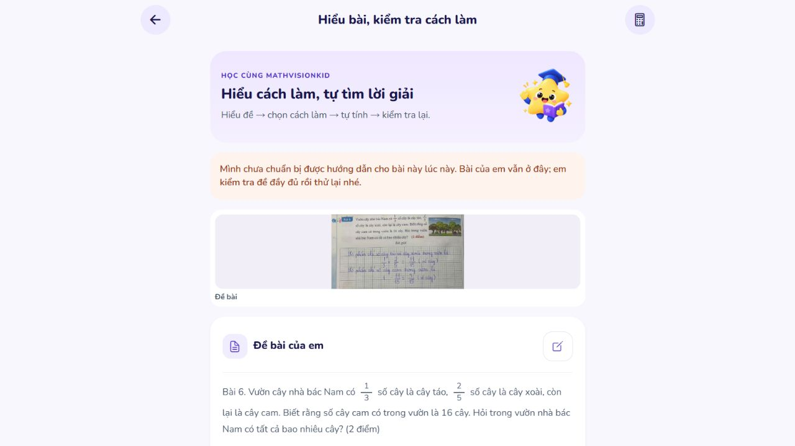

# Dynamic photo tutoring — deployment and verification

Date: 2026-10-10. Owner instruction: continue the remaining repairs and deploy them.

## Deployment status

The dynamic tutoring implementation has been deployed to the AI services serving [the existing student website](https://mathvisionkid-portal.vercel.app). The frontend address and API contract remain the same; the replacement is in the server that handles image reading and lesson planning. No Vercel static rebuild was needed for these server changes.

The deployment is the existing PC preview architecture. API, trained OCR and worker execution still depend on this PC and Docker running. This phase did not establish independent 24/7 cloud hosting. Free AI-provider quotas and availability also remain material limits; a healthy server cannot guarantee an available model request.

Public lesson verification is recorded below after the final check. A startup health check alone is not considered proof of a completed lesson.

## Repairs

- Replace the ambiguous nullable planning envelope with a flat, constrained draft containing an explicit `canSolve` boolean. Incomplete or honestly refused drafts still cannot publish a session. The complete local plan validation and separate semantic review remain mandatory.
- Reduce the planning prompt and output budget, specify paragraph types explicitly, and require simple explanations of quantities, operation and order. Initial guidance receives an answer-free arithmetic starting action when two model explanation paragraphs remain after worked help is hidden. Literal fraction pairs are treated as quantities when choosing the starting operation.
- Retain exact fraction grading, wrong-answer/no-advance behavior, account ownership, revision checks, timeout limits and current/future answer separation. Fix the future-answer matcher so a value immediately before sentence punctuation is not missed.
- Reuse already checked fractions even when the model writes their reciprocal, with whitespace or parentheses. Normalize that equivalent private formula to its exact prior-step dependency; this neither changes photographed numbers nor supplies a new answer.
- Resolve model-selected work row indexes on the server. The source rows are explicitly numbered as data. Referenced excerpts preserve the complete original span, including any intervening rows; altered, out-of-range, repeated or reversed references cannot become source evidence. The model no longer has to retype a handwritten equality to refer to it.
- Distinguish dimensionless fractions/shares from actual item counts. A lesson asking for a fraction/share cannot copy a count unit such as `số cây` from pupil work. Fractions of physical measurements can still retain their actual measurement unit.
- Bound Gemini 3 thinking to low effort so it can emit JSON within the response budget. Join all visible text fragments while excluding thoughts, and refuse unfinished/safety-blocked output. Give whole-photo transcription a larger bounded response budget. Preserve the instruction to transcribe visible work rather than solve or correct its digits.
- Reduce repeated review input. The independent reviewer receives the confirmed original question, locally evaluated formulas, all initial/private teaching, and exact relevant pupil-work excerpts. Duplicate whole-work copies and guidance are omitted; source-excerpt provenance is checked locally before review.

No production image-to-answer mapping, problem-family solution table, model training, new model dependency, new credential, purchase, account change, commit or push was introduced.

## Automated verification

From `ai/runtime`:

```text
.venv/Scripts/python.exe -X utf8 -m pytest tests -q --tb=short
```

**1549 passed, 7 skipped, 4 dependency/lifecycle deprecation warnings**, in 148.43 seconds. This complete run covers source-row references, exact reciprocal normalization, starting actions and response parsing. Afterwards, teaching-prompt wording, removal of an unused envelope model, and the correction feedback for count labels on fraction work changed. The final focused checks passed **329 tests**, including the last feedback change.

The focused checks cover image reading, lesson contracts, fractions, source grounding, field shapes, work-index bounds and order, exact original excerpts, invalid units, legitimate physical units, future answers before punctuation, wrong pupil answers, authentication boundaries, rejected semantic review, provider failure, JSON fragments and strict boolean handling. `git diff --check` passed for the scoped code/test changes.

These are software regression results, not an OCR accuracy percentage or proof that every possible problem will be taught correctly.

## Real model and image checks

- Configured-provider runs generated and reviewed correct lessons for appending digit `6` with difference `537` (requested answer `59`), the garden fractions (requested total `60`), sharing `126` books among `7` groups then adding `3` (`21`), and a changed sum/difference goal asking for the product (`1632`). Plans came from actual model calls; teacher-expected numbers were held only in the ignored evaluation harness.
- Human inspection and subsequent public testing exposed remaining problems: an inappropriate count unit on a fraction, rewritten work excerpts, private formula literals instead of dependencies, insufficient initial teaching, and unsupported structured-schema choices. Those failures informed the repairs above. An unsupported array-union schema experiment was removed after provider rejection.
- Extra fresh-number/changed-goal probes encountered provider rate limits and fallback failures. They are recorded as unavailable, not successful teaching. The release does not claim that all cases or all Drive images were recognized.
- The owner's supplied garden photo was read as original question plus work. It retained the visible `1/3`, `2/5`, `16`, and written `11/15`/`4/15`; uncertain reading remains marked. The public browser flow required manual comparison and source confirmation before planning. No missing source digit was filled by calculating an answer.
- A reviewer falsely treated the pupil's wrong units in an exact work excerpt as an error in the lesson itself. The final prompt separates intentionally preserved pupil work from the lesson's own units. Exact numerical matches with a photographed count label on a share now receive an explanation to write `phần`, rather than being reported as a numerical mistake.
- The final browser test uses the actual supplied PNG, selected through the website's library flow, privacy confirmation and crop screen. It does not inject a lesson, alter application state or preload answers. Source editing only removes the uncertainty marker after visually comparing the photographed question.

The private evaluation traces include rejected drafts and numeric answer material and remain in ignored local runtime state. Credentials and access tokens are not written into this report.

## Public access checks

Seven checks against the actual Vercel address passed: student login, rejecting unconfirmed source, rejecting unread source, anonymous lesson denial, private route not published, teacher denial on student lesson creation, and student denial on administrator access. Vercel returns `405` for the private POST route; the private gateway returns `404`. Neither route exposes the internal AI endpoint.

## Release mechanics and recovery

The existing AI image was retained as `mathvision-ai:before-dynamic-teaching-20261010`. Cached dependency layers were reused; the new builds copy the application code and do not copy photo datasets or model bundles into an image. Models remain mounted read-only.

Only `ai` and `worker` in Compose project `mathvision-pc-preview` were recreated with `--no-build --no-deps` and waited for health. The database, object storage, backend, gateway and current tunnel were retained. The saved image is available for rollback if the new services fail readiness. Lesson sessions are in-memory and a deployment requires starting a new lesson session.

Final running image: `sha256:86a0444c639948f51ca33fefb635c984878c208160c84301c23e3698bef90819`. The deployed `lesson.py` SHA-256 is `c748988798ce6b6c5e1bc1405249cb8a9c22574396e46baedf888980a016ece7`, identical to the tested workspace source. Both updated services passed health. Public access checks were repeated successfully on this final image.

## Public lesson result

**Deployment is complete, but the final end-to-end lesson is not verified as working.** At 14:36:48 UTC the primary returned `429` with a 384-second cooldown and the fallback returned `503`. After waiting, a later attempt still returned rate limits. An intervening available-provider attempt exposed the pupil-work review issue described above, which was corrected.

On the final image, the 14:55:51 UTC attempt returned primary `429` with a 634-second cooldown and fallback `429` with a 300-second cooldown, producing public `503`. It did not create an unreviewed lesson or use a prebuilt answer. The site retained the uploaded photo, actual transcription, manual confirmation and retry controls. Further repeated model requests were stopped; no credential sweep, paid upgrade or fabricated success was used to complete the check.

The website is reachable and authentication/source guards pass, but **current free-provider availability prevents declaring the new tutoring flow fully stable**. A successful complete browser lesson on this final build remains required once an available provider is configured or its quota recovers. The existing PC dependency also remains.



## References

- [Expo SDK 57](https://docs.expo.dev/versions/v57.0.0/) — required project reference read before implementation.
- [Groq structured outputs](https://console.groq.com/docs/structured-outputs) and [Groq API reference](https://console.groq.com/docs/api-reference) — draft shape and bounded hidden reasoning.
- [Gemini thinking controls](https://ai.google.dev/gemini-api/docs/generate-content/thinking) — low effort, thought exclusion and output-budget truncation behavior.

## Skills Applied

- `ponytail`
  - SKILL.md: `.agents/skills/ponytail/SKILL.md`
  - Why selected: reuse the existing exact arithmetic, model transport, source confirmation and deployment stack while fixing the actual failure points.
  - Applied to: draft validation, source-row references, teaching/response handling, request deduplication, focused tests and cached service rollout. No new solver framework, dependency or parallel agent was added.
