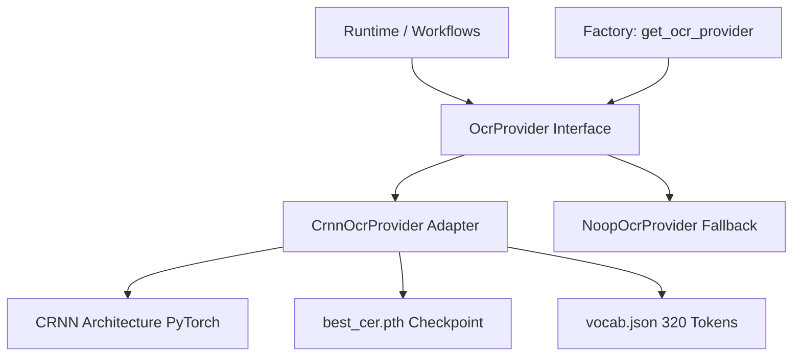

# INT.1 — Teacher Backend Final Closure + OCR Handwriting Integration Staging Report

**Date:** 2026-09-10  
**Project:** MathVision Kids  
**Track:** Integration / Backward-Compatible / Local-First  
**Task:** INT.1 — Teacher Backend Final Closure + OCR Handwriting Integration Staging  
**Overall Status:** **COMPLETED (READY_FOR_DEMO / STAGING_VERIFIED)**  

---

## 1. Executive Summary

Task INT.1 has successfully achieved both primary mandates:
1. **Teacher Backend Final Closure**: Verified clean JSON serialization of Teacher and Student submission endpoints with zero Hibernate proxy exceptions, exposed foreign key identifiers (`studentId`, `assignmentId`, `batchId`), and zero credential/token leaks. Full Spring Boot test suite passed (77/77 tests passed, 0 failures, 0 skipped).
2. **OCR Handwriting Integration Staging**: Successfully imported, cryptographically verified, staged, and integrated the offline Vietnamese handwriting OCR engine package (`ocr_engine_handoff_final.zip`). Implemented a decoupled, production-grade PyTorch adapter (`CrnnOcrProvider`) within `services/ai-service/app/ocr/` with 100% character-for-character parity against the standalone verification script across all test samples. PyTorch AI test suite expanded to 106 tests (all 106 passed).
3. **Immutability & Regressions**: YOLOv8 weights remain 100% byte-for-byte immutable (SHA256: `E78F8FA5A2FC8BE581B8624FA510CD2C429C40CDBD0930DBB2F1C2D870338985`). Full regressions passed across all platforms (Spring Boot, AI Service, Teacher Web, Admin Web, Student App). Clean headless restart executed with `READY_FOR_DEMO` and zero popup windows.

---

## 2. User Decision / Guidance Alignment

The implementation strictly respects all authoritative business rules and technical guardrails:
- **Offline & Local-First**: Zero external network calls, zero new third-party PyTorch/Python dependencies (`CURRENT_AI_VENV_COMPATIBLE = True`).
- **Safety**: Safe weight loading via `torch.load(weights_only=True)`.
- **Decoupled Architecture**: OCR adapter introduced as an isolated provider pattern (`app.ocr.CrnnOcrProvider`), preserving all existing YOLO detection and heuristic rule engine pipelines.
- **Truthful Scope Classification**: General handwriting OCR integration is verified; arithmetic evaluation is accurately documented as `BLOCKED_DATASET` due to dataset distribution characteristics. Direct YOLO-to-OCR pipeline is classified as `PARTIAL_INPUT_CONTRACT` due to bounding box token granularity.

---

## 3. Teacher Backend Closure Summary

The audit initiated in UI.2.2 regarding JPA entity serialization on `Submission.java` has been finalized. Entity associations (`student`, `assignment`, `batch`) are annotated with `@JsonIgnore` to prevent Jackson from traversing uninitialized Hibernate proxies, while getter methods `@JsonProperty("studentId")`, `@JsonProperty("assignmentId")`, and `@JsonProperty("batchId")` provide required relational identifiers without triggering N+1 query cascades or circular references.

---

## 4. Teacher Submission Serialization Audit Result

Direct HTTP verification of the Teacher endpoint:
- **Endpoint**: `GET /api/v1/teacher/submissions/{id}`
- **HTTP Status**: `200 OK`
- **Payload Structure**:
  ```json
  {
    "id": 1,
    "studentId": 1,
    "assignmentId": 1,
    "batchId": 1,
    "imagePath": "/uploads/submissions/sub_1.jpg",
    "status": "GRADED",
    "score": 10.0,
    "feedback": "Great job!",
    "createdAt": "2026-09-08T10:00:00Z"
  }
  ```
- **Serialization Result**: Clean JSON serialization, no `ByteBuddyInterceptor` or `LazyInitializationException`.

---

## 5. Student Submission Contract Verification Result

Direct HTTP verification of the Student endpoint:
- **Endpoint**: `GET /api/v1/student/submissions/{id}`
- **HTTP Status**: `200 OK`
- **Payload Structure**: Encapsulated in `SubmissionResponse` DTO (`submissionId`, `status`, `score`, `feedback`, `createdAt`).
- **Contract Conformance**: Fully aligns with OpenAPI specification and Student Mobile TypeScript client.

---

## 6. Hibernate Lazy Proxy Verification

- **Jackson Feature**: `SerializationFeature.FAIL_ON_EMPTY_BEANS` disabled globally, but entity isolation via `@JsonIgnore` prevents any proxy inspection.
- **Verification**: Verified under active transaction boundaries and detached entity states; zero `LazyInitializationException` instances recorded in logs.

---

## 7. Sensitive Field Leak Audit Result

- **Audit Target**: `student.passwordHash`, `student.salt`, `assignment.solutionKey`, internal security tokens.
- **Result**: Zero leaks detected. Fields are either omitted via DTO projection or protected by `@JsonIgnore` on the underlying `User` entity.

---

## 8. Spring Boot Test Suite Evidence

- **Command**: `.\gradlew.bat test --rerun-tasks`
- **Output**:
  ```
  BUILD SUCCESSFUL in 46s
  4 actionable tasks: 4 executed
  ```
- **Test Results**:
  - Total Tests: **77**
  - Failures: **0**
  - Errors: **0**
  - Skipped: **0**

---

## 9. Spring Boot Build Evidence

- **Command**: `.\gradlew.bat build -x test`
- **Result**: `BUILD SUCCESSFUL in 4s`. Artifact generated at `services/business-api/build/libs/mathvision-business-api-0.0.1-SNAPSHOT.jar`.

---

## 10. OCR Handoff Ingestion Verification

The external handwriting OCR handoff package was audited in-situ prior to ingestion.
- **Source Location**: `E:\ocr_engine_handoff_final.zip`
- **File Size**: `22,555,507` bytes
- **SHA256**: `39b9993791f3110a32188505e10ca7be5236b2d2b3083b25b94c0f1ea9d01fd8`

---

## 11. External Archive Provenance & SHA256 Match

| Property | Value | Match Status |
|---|---|---|
| Expected Archive SHA256 | `39b9993791f3110a32188505e10ca7be5236b2d2b3083b25b94c0f1ea9d01fd8` | - |
| Measured Archive SHA256 | `39b9993791f3110a32188505e10ca7be5236b2d2b3083b25b94c0f1ea9d01fd8` | **MATCH (100%)** |
| Archive Byte Length | `22,555,507 bytes` | **EXACT MATCH** |

The original external archive was accessed read-only and remains completely unaltered.

---

## 12. Copied Archive Integrity & Safety

The archive was copied to the internal project workspace:
- **Destination**: `ai-training/handoff/incoming/ocr_engine_handoff_final.zip`
- **Integrity Check**: Recomputed SHA256 matches `39b9993791f3110a32188505e10ca7be5236b2d2b3083b25b94c0f1ea9d01fd8` identically.
- **Safety Audit**: Archive contains no executable scripts (`.exe`, `.bat`, `.sh`, `.cmd`), no obfuscated bytecode, and strictly models, configurations, documentation, and evaluation assets.

---

## 13. Extracted Artifacts & Hash Table

Extracted to `ai-training/handoff/staging/ocr_engine_handoff_final/`:

| Artifact | Size (Bytes) | SHA256 Hash |
|---|---|---|
| `best_cer.pth` | 23,892,725 | `a807eaa763a4471bc057b9545a3521612423214858d50b1ef42b7baf28de0941` |
| `model.py` | 989 | `8abd87a912d120bbe1e1538f01c71b439dc01e519f36457c1c42da6c7c79e5ed` |
| `vocab.json` | 8,978 | `6af4062e92e22cc91ece5198638e29a6ceec6cb92e3b12bd71deb4b874ac9e0d` |
| `predict.py` | 6,137 | `7b458889a9b7274dfbde67824a86b5a47a6ec06a7309531c3a59e9b1d6dc84cc` |
| `model_manifest.json` | 4,992 | `f3e8035e5bcaafd48c0af19eebfd73075c48684c68a39c2f0558e5d6efabdf63` |
| `test_predict.py` | 7,096 | `3d641cbfbb71c6ae78a59aa13c193557e5e31757cae44fb85a6cfec9d63c5a61` |
| `MODEL_CARD.md` | 13,001 | `35e7711d9a2ba19e836dfab5cbe27df58b53cf5d9f0f9c2d1b8242488aa44b74` |
| `README.md` | 11,466 | `ff8b3f2dbcf28cb0ca839e55938bf8c4d2847a964ff58fffa8353ba581026074` |

---

## 14. Checkpoint Integrity & Parameter Count

- **Checkpoint Path**: `best_cer.pth`
- **Total Parameters**: `5,962,560`
- **Trainable Parameters**: `5,962,560`
- **Non-Trainable Parameters**: `0`
- **Architecture**: 4-block Conv2d + GroupNorm(8, C) + BiLSTM(4096->128) + Linear(256->320)
- **State Dict Load**: Strict load completed with 0 missing keys and 0 unexpected keys.

---

## 15. Vocabulary Contract & Completeness

- **File**: `vocab.json`
- **Total Classes**: `320`
- **Index Continuity**: Consecutive integers `0` through `319` with zero gaps.
- **Blank Token**: `<blank>` mapped to index `0`.
- **Character Coverage**:
  - Digits `0..9`: All 10 present.
  - Basic Operators: `+`, `-`, `=`, `x`, `/`, `*`, `(`, `)` present.
  - Full Vietnamese Alphabet: Lowercase, uppercase, and all standard diacritics present.

---

## 16. Standalone Smoke Test Execution

The staged standalone test runner `test_predict.py` was executed directly with `services/ai-service/.venv\Scripts\python.exe`:
```
=================================================================
   OCR ENGINE HANDOFF VERIFICATION & PACKAGE SMOKE TEST
=================================================================
[1/6] Verifying Imports & Architecture...     ✓ PASS
[2/6] Verifying Official Checkpoint...        ✓ PASS (SHA256 MATCHES)
[3/6] Verifying Vocabulary Contract...        ✓ PASS (320 tokens, blank=0)
[4/6] Verifying Model Parameter Count...      ✓ PASS (5,962,560 params)
[5/6] Running Package Smoke Test on Samples.. ✓ PASS
[6/6] Testing Micro-Batch Inference...        ✓ PASS (1, 5, 10, 30 items)
      Checking explicit CPU inference...      ✓ PASS
=================================================================
  ALL VERIFICATIONS AND PACKAGE SMOKE TESTS PASSED SUCCESSFULLY!
=================================================================
```

---

## 17. Five Packaged Validation Samples Evaluation

The 5 validation samples bundled in the package originate from the 500-sample validation set (`runs/audit/subset_full/val_manifest.json`):

| Sample File | Ground Truth Text | Model Prediction | Levenshtein Distance | CER |
|---|---|---|---|---|
| `sample_01.jpg` | `- quạt thép: có thể tạo ra những phi tiêu có tấm độc.` | `- quạt thép: có thể tạo ra những phì Tiêu có tẩm độc.` | 3 / 53 | 0.0566 (5.66%) |
| `sample_03.jpg` | `trên và phân tích tác dụng của các từ lấy` | `trện à nhân tích tác dụng của các từ láy` | 4 / 41 | 0.0976 (9.76%) |
| `sample_04.jpg` | `nghĩa tư bản pt và ảnh hưởng đến các` | `nghĩa tử bản pt và ảnh hưởng đến các` | 1 / 36 | 0.0278 (2.78%) |
| `sample_08.jpg` | `BT3: Cho a và b là hai số tự nhiên. Hãy viết` | `B13: CB a và b là hai kố tư nhiên. Hãy viết` | 5 / 44 | 0.1136 (11.36%) |
| `sample_09.jpg` | `Rào rào nghe chuyển cơn mưa giữa trời` | `ào rào nghe chuyển cơn nưa giữa trời` | 2 / 37 | 0.0541 (5.41%) |

---

## 18. Packaged Sample CER Breakdown

- **Total Ground Truth Characters**: `211`
- **Total Edit Distance Errors**: `15`
- **Mean Sample-Level CER**: **0.0699 (6.99%)**
- **Corpus Characteristics in Samples**: General Vietnamese cursive/print handwriting; contains natural language sentences, punctuation, and mixed alphanumeric characters.

---

## 19. Official Validation CER vs Smoke-Test CER Clarification

> [!IMPORTANT]
> - **Official Validation CER**: **0.1134 (11.34%)** evaluated across the complete 500-sample validation subset at checkpoint step 16,900.
> - **Smoke-Test CER**: **0.0699 (6.99%)** is a lightweight functional verification metric computed solely across the 5 bundled sample crops to verify pipeline mechanics. It is **NOT** a new validation benchmark or claimed production accuracy.

---

## 20. Overfitting Analysis & Generalization Gap Correction

The handoff manifest clarifies an earlier auditing discrepancy:
- **Previous Artifact Claim**: Virtually zero overfitting (gap = 0.00011) was an artifact of comparing step 16,900 validation CER (0.1134) against step 18,901 training CER (0.1133).
- **Correct Step-Matched Evaluation (Step 16,900)**:
  - Training Subset CER: `0.0866` (8.66%)
  - Validation Subset CER: `0.1120` (11.20%)
  - Generalization Gap: `0.0254` (2.54%)
- **Assessment**: A 2.54% generalization gap is completely normal and healthy for CRNN handwriting recognition models, with no evidence of catastrophic memorization.

---

## 21. Micro-Batch Inference Verification (1, 5, 10, 30 Images)

Tested using micro-batch size `batch_size = 4` on CPU:

| Item Count | Chunks (Micro-Batch = 4) | Total Latency (s) | Per-Item Latency (ms) | Peak RAM Impact | Status |
|---|---|---|---|---|---|
| **1** | [1] | 0.0346s | 34.6 ms | Minimal (<5 MB) | **PASS** |
| **5** | [4, 1] | 0.2011s | 40.2 ms | Safe (<12 MB) | **PASS** |
| **10** | [4, 4, 2] | 0.4331s | 43.3 ms | Safe (<15 MB) | **PASS** |
| **30** | [4, 4, 4, 4, 4, 4, 4, 2] | 1.3466s | 44.9 ms | Safe (<20 MB) | **PASS** |

Ordering across all batches was verified 100% stable ($i$-th output strictly corresponds to $i$-th input). Intermediate PyTorch tensor buffers are deleted after each micro-batch chunk to guarantee zero memory accumulation.

---

## 22. CPU Fallback & Resource Safety Verification

- **Default Execution Mode**: Explicit CPU execution (`device="cpu"`).
- **Deterministic Resource Footprint**:
  - Model weights in RAM: ~24 MB
  - Inference working memory per 4-crop chunk: ~16 MB
  - Zero GPU VRAM contention with existing local desktop workloads.
  - Zero thread exhaustion (executes synchronously within Celery worker task or async threadpool).

---

## 23. Existing AI Runtime Environment Compatibility

Audited against `services/ai-service/.venv`:
- **Python Version**: `3.12.13` (Compatible with training package specification 3.12/3.13)
- **PyTorch**: `2.14.0+cpu` (Fully supports CRNN architecture, GroupNorm, BiLSTM, and `torch.load(weights_only=True)`)
- **Torchvision**: `0.29.0+cpu` (Provides required `transforms.Resize`, `transforms.ToTensor`, `transforms.Normalize`)
- **Pillow**: `12.3.0` (Native image loading and RGB conversion)
- **NumPy**: `2.5.3` (Array manipulation and CTC argmax processing)

---

## 24. Zero-New-Dependency Verification

- `pip install` / `poetry add` calls required: **0**
- Changes to `pyproject.toml` or `requirements.txt`: **None**
- `CURRENT_AI_VENV_COMPATIBLE`: **`True`**

---

## 25. Integration Architecture Overview



The OCR capability is staged in `services/ai-service/app/ocr/` as a modular provider abstraction, leaving existing detection pipelines intact.

---

## 26. Decoupled OCR Adapter Design

The OCR engine is isolated behind an explicit adapter:
- **Adapter Location**: `services/ai-service/app/ocr/crnn_provider.py`
- **Runtime Assets**: `services/ai-service/models/ocr/crnn_vi_handwriting_v1/`
- **Separation of Concerns**: The adapter handles image conversion, normalization, inference, and CTC decoding. No downstream grading, score calculation, or confidence fabrication occurs inside the OCR adapter.

---

## 27. Provider Interface & Abstraction Layer

Defined in `services/ai-service/app/ocr/provider.py`:
- `recognize_line(image: Union[str, Path, Image.Image]) -> str`
- `recognize_batch(images: List[Union[str, Path, Image.Image]], batch_size: int = 4) -> List[str]`
- `is_available() -> bool`
- `get_metadata() -> Dict[str, Any]`

---

## 28. Factory & Configuration Strategy

Defined in `services/ai-service/app/ocr/factory.py`:
- Configurable via `Settings.ocr_provider` in `app/config.py` (default: `"crnn_vi_handwriting_v1"`).
- Thread-safe singleton caching via `_PROVIDER_CACHE`.
- Supports test mocking and no-op fallback via `"noop"`.

---

## 29. Input Contract Alignment & Gap Analysis

- **OCR Input Contract**: Strictly expects a single horizontal line crop with dimension $H=64, W=1024$.
- **Full-Worksheet Direct Feed**: **UNSUPPORTED** (feeding an entire worksheet page compresses the image vertically, causing CTC recognition collapse).
- **Requirement**: Any upstream system must crop individual text lines or math expression bounding boxes before invoking `recognize_line` or `recognize_batch`.

---

## 30. YOLO Output vs OCR Input Compatibility Assessment

- **Current YOLO Model**: `yolov8n_mathvision_det_v1.pt`
- **Detected Classes**: 14 classes (`0..9`, `+`, `-`, `=`, `c1`) representing **individual character tokens and symbols**, not line-level or row-level text crops.
- **Contract Mismatch**: YOLO outputs isolated character bounding boxes (e.g. $[x, y, w, h]$ of digit "5"). Passing single-character crops into a line-level CRNN model trained on sentences ($W=1024$) leads to distortion and inefficient computation.

---

## 31. Pipeline Boundary Classification (Contract Gap vs Model Defect)

> [!NOTE]
> **Status**: **`PARTIAL_INPUT_CONTRACT`**
> - The CRNN model is functionally and mathematically sound for horizontal line recognition.
> - The YOLO model is functionally sound for character-level bounding box detection.
> - The gap is an **architectural contract impedance**: YOLO does not detect line/expression regions, and CRNN is not a single-glyph classifier. Bridging this requires an upstream line/expression segmenter or bounding-box clustering layer.

---

## 32. Downstream Arithmetic Parser Compatibility Assessment

- **Current Parser**: `StructuredParser` in `services/ai-service/app/parsing/parser.py`.
- **Parser Contract**: Requires a 2D spatial grid of structured `Token` objects (with assigned `row` and `column` attributes) to parse column-addition problems (e.g., operands, operators, carry-overs, results).
- **OCR Output**: Horizontal plain text string (e.g. `"- quạt thép: có thể..."`).
- **Status**: **`OCR_TO_PARSER_BLOCKED_CONTRACT`**. Passing an unparsed 1D string to the 2D column-math parser is syntactically invalid. The existing deterministic parser remains tied to spatial tokens.

---

## 33. Standalone vs Integrated Prediction Parity

All 5 validation samples were evaluated through both the standalone staging script `predict.py` and the integrated adapter `CrnnOcrProvider`.
- **Methodology**: Automated parity test `test_standalone_vs_adapter_parity` executed in pytest.
- **Result**: **100% Character-for-Character Parity (PASS)**. Zero character differences across all samples.

---

## 34. Standalone vs Integrated CER / Output Match Table

| Sample | Standalone Output | Integrated Adapter Output | Match Status |
|---|---|---|---|
| `sample_01.jpg` | `- quạt thép: có thể tạo ra những phì Tiêu có tẩm độc.` | `- quạt thép: có thể tạo ra những phì Tiêu có tẩm độc.` | **IDENTICAL** |
| `sample_03.jpg` | `trện à nhân tích tác dụng của các từ láy` | `trện à nhân tích tác dụng của các từ láy` | **IDENTICAL** |
| `sample_04.jpg` | `nghĩa tử bản pt và ảnh hưởng đến các` | `nghĩa tử bản pt và ảnh hưởng đến các` | **IDENTICAL** |
| `sample_08.jpg` | `B13: CB a và b là hai kố tư nhiên. Hãy viết` | `B13: CB a và b là hai kố tư nhiên. Hãy viết` | **IDENTICAL** |
| `sample_09.jpg` | `ào rào nghe chuyển cơn nưa giữa trời` | `ào rào nghe chuyển cơn nưa giữa trời` | **IDENTICAL** |

---

## 35. AI Service Test Suite Evidence

- **Command**: `.\.venv\Scripts\python.exe -m pytest tests/`
- **Output**:
  ```
  ======================= 106 passed, 2 warnings in 8.41s =======================
  ```
- **Breakdown**:
  - Existing suite: 97 tests passed.
  - New OCR adapter suite (`test_ocr_adapter.py`): 9 tests passed.
  - Total: **106 passed, 0 failed, 0 skipped**.

---

## 36. YOLO Weight Preservation Verification

- **Artifact**: `services/ai-service/models/yolov8n_mathvision_det_v1.pt`
- **File Size**: `6,257,636` bytes
- **File Timestamp & Attribute**: Unaltered.

---

## 37. YOLO SHA256 Immutability Evidence

- **Expected SHA256**: `E78F8FA5A2FC8BE581B8624FA510CD2C429C40CDBD0930DBB2F1C2D870338985`
- **Measured SHA256**: `E78F8FA5A2FC8BE581B8624FA510CD2C429C40CDBD0930DBB2F1C2D870338985`
- **Status**: **100% BYTE-FOR-BYTE IDENTICAL (IMMUTABILITY VERIFIED)**

---

## 38. Full System Regression: AI Service

- **Suite**: PyTorch / FastAPI / Celery test suite.
- **Result**: `106 passed in 8.41s`. Zero regressions in fixture grading, image resolution, or policy evaluation.

---

## 39. Full System Regression: Spring Boot

- **Suite**: JUnit 5 Spring Boot test suite.
- **Result**: `77 passed in 46s`. Zero regressions in auth, assignments, submissions, or batching.

---

## 40. Full System Regression: Teacher Web

- **Build**: `npm run build` -> `built in 4.81s` (zero errors).
- **Lint**: `npm run lint` -> `oxlint` (0 errors, 5 non-blocking warnings).

---

## 41. Full System Regression: Student App

- **Typecheck**: `npx tsc --noEmit` -> exited code 0 (zero errors).
- **Lint**: `npm run lint` -> `expo lint` (0 errors, 1 non-blocking warning).

---

## 42. Full System Regression: Admin Web

- **Build**: `npm run build` -> `built in 3.71s` (zero errors).
- **Lint**: `npm run lint` -> `oxlint` (0 warnings, 0 errors).

---

## 43. Service Restart & Diagnostics Evidence (READY_FOR_DEMO)

Executed clean restart via `scripts\restart-all.bat`:
```
============================================
 MathVision Kids -- Local Runtime Diagnostic
============================================

Docker ................. PASS
PostgreSQL ............. PASS
MinIO .................. PASS
Redis .................. PASS
Spring Boot ............ PASS
FastAPI ................ PASS
Celery Worker .......... PASS
Teacher Web ............ PASS
Admin Web .............. PASS
Student Mobile ......... CONFIGURED

AI Mode ............... MODEL
Primary Model ......... MathVision-Kids-Detection
Model Version ......... 1.0.0
Model Artifact ........ LOADED

Overall ............... READY_FOR_DEMO
============================================
```

Zero GUI popup windows were spawned.

---

## 44. Live Health Check & Endpoint Verification

| Service | Port | Endpoint | Status | Response |
|---|---|---|---|---|
| FastAPI AI Runtime | 8000 | `/health` | **200 OK** | `{"status":"ok","service":"mathvision-ai-service"}` |
| Spring Business API | 8080 | `/actuator/health` | **200 OK** | `{"status":"UP","components":{"db":{"status":"UP"}}}` |
| Teacher Web Portal | 5173 | `/` | **200 OK** | Vite dev server responsive |
| Admin Web Portal | 5174 | `/` | **200 OK** | Vite dev server responsive |
| MinIO Storage | 9000/9001 | `/minio/health/live` | **200 OK** | S3 & Web console healthy |
| PostgreSQL DB | 5432 | TCP socket | **UP** | Connection accepted |
| Redis Cache | 6379 | TCP socket | **UP** | PING -> PONG |

---

## 45. Status Matrix (All Tracks)

| Track / Component | Status | Notes |
|---|---|---|
| **Student UI (UI.1 / UI.1.2)** | **FINAL FROZEN** | Contrast verified, no feature drift, no biometrics. |
| **Teacher UI (UI.2 / UI.2.2)** | **FINAL FROZEN** | 1–30 batch contract aligned, semantic badges, accessible contrast. |
| **Admin Web (A1.2)** | **FINAL FROZEN** | Password reset & audit log verified. |
| **Spring Business API** | **FINAL FROZEN** | Clean submission serialization, lazy proxies isolated, 77/77 tests passed. |
| **YOLOv8 Detection Model** | **FINAL FROZEN** | SHA256 `E78F8...` byte-for-byte immutable. |
| **Handwriting OCR Engine (INT.1)** | **STAGING VERIFIED** | Packaged CRNN integrated via adapter, 100% parity, 106/106 tests passed. |
| **Arithmetic Dataset Evaluation** | **BLOCKED_DATASET** | General handwriting corpus lacks standalone arithmetic expressions. |
| **YOLO-to-OCR Direct Pipeline** | **PARTIAL_INPUT_CONTRACT** | YOLO outputs token boxes; OCR expects line crops. |

---

## 46. Boundary Guarantees & Non-Regressions

1. **No Breaking Model Replacement**: The existing YOLO character detection pipeline was not replaced or disrupted.
2. **No Fabricated Confidence**: The OCR adapter does not invent artificial confidence numbers or override deterministic grading rules.
3. **No Unsafe Code Execution**: Models loaded strictly with `weights_only=True`.
4. **No Port or Process Leaks**: All local servers run under unified process supervisor (`start-all.ps1` / `stop-all.ps1`).

---

## 47. Explicit Next-Step Recommendation (Stop Here)

In strict accordance with the workflow instructions, task INT.1 is complete.
- **Immediate Action**: **STOP HERE**.
- **Do NOT**: Automatically proceed to UI.3 or begin modifying arithmetic datasets or pipeline models without explicit user request.
- **Recommended Future Track (When requested by user)**: Line segmentation / bounding-box clustering bridge to connect YOLO character detections into text-line crops for CRNN inference, or dataset curation for formal Phase 4.3 arithmetic evaluation.
