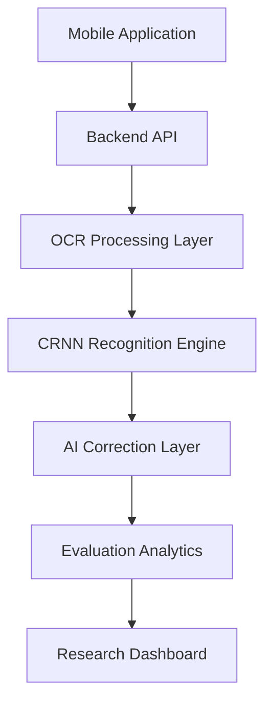
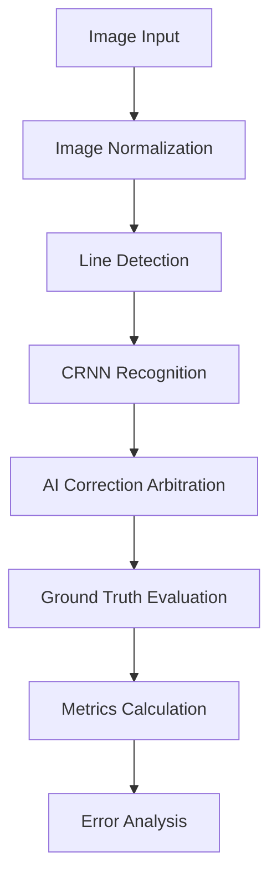
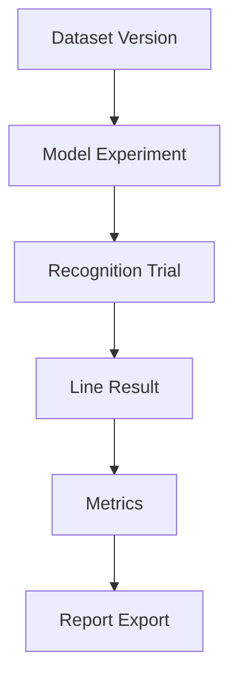

# HandAI System Architecture

## 1. High-Level Architecture
HandAI is built on a streamlined, mobile-first architecture utilizing native processing and cloud intelligence to provide robust, academically sound handwriting evaluation.

## 2. Detailed AI Pipeline
The core evaluation pipeline follows a strict, sequential process ensuring that raw model performance and AI enhancements are independently measurable:

## 3. Data Flow and Provenance
To ensure academic integrity, every evaluation adheres to a rigid data provenance chain:

- **Dataset Version**: Fixed splits, bounding boxes, and image augmentations.
- **Model Experiment**: Tracks specific weights, framework (PyTorch), and hyperparameters.
- **Recognition Trial**: Immutable session capturing image quality and latency.
- **Metrics & Export**: Ensures all numbers calculated in the UI are permanently attached to their corresponding trials.
