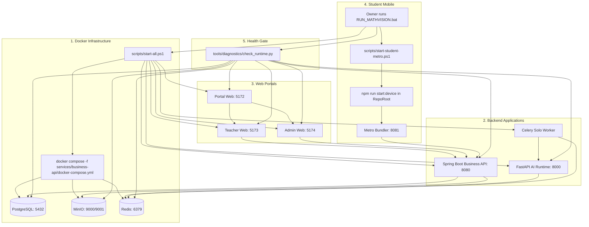

# MATHVISION KIDS — REPOSITORY TOPOLOGY AUDIT & MONOREPO MIGRATION PLAN
**Document ID:** `MATHVISION-KIDS-ARCH-AUDIT-2026-09-21`  
**Phase:** MATHVISION.KIDS.REPOSITORY-STRUCTURE.AUDIT  
**Status:** ANALYSIS-ONLY (Hard Read-Only — No Files Moved or Modified)  
**Author:** Senior Software Architect  
**Audience:** Project Owner & ChatGPT Review  

---

## Skills Applied

- `ponytail-audit`
  - SKILL.md: `.agents/skills/ponytail-audit/SKILL.md`
  - Why selected: Whole-repository architectural audit to identify structural debt, bloat, misplaced root items, duplicated configurations, and over-engineering without executing premature modifications.
  - Applied to: Categorizing all top-level artifacts, tracing path-reference graphs, identifying duplicated models/contracts, and designing the minimal-overhead monorepo migration sequence.
- `ponytail`
  - SKILL.md: `.agents/skills/ponytail/SKILL.md`
  - Why selected: Ensuring the target repository structure uses standard platform features (native npm workspaces, standard Gradle subprojects, standard Python package layouts) rather than introducing heavy external tooling (e.g., Lerna, Nx, custom symlink managers).
  - Applied to: Choosing native npm workspaces with Expo SDK 57 support and standard multi-project folder boundaries.

---

## 1. Executive Summary

The MathVision Kids repository has reached an architectural inflection point. It contains six independent sub-applications and pipelines:
1. **Student Mobile App:** React Native / Expo SDK 57 / Expo Router (Grades 1–5 arithmetic capture & tutoring)
2. **Teacher Web Portal:** React 19 / Vite / Material UI (Review queue, grading approval, override)
3. **Admin Web Portal:** React 19 / Vite / Material UI (System configuration, user management)
4. **Unified Portal Web:** React 19 / Vite / Material UI (Ecosystem hub & role-based redirection)
5. **Business API Backend:** Java 21 / Spring Boot 3.3 / PostgreSQL / MinIO / Redis (Security authority & RBAC)
6. **AI Service Runtime:** Python 3.12 / FastAPI / Celery / YOLO11n / CRNN / Groq & Gemini advisors (AI inference)
7. **AI Training Workspace:** CRNN & YOLO model training pipelines, annotations, datasets, and benchmarks.

### The Problem
Currently, the **Student Mobile App resides directly at the repository root**. Its `package.json`, `app.json`, `tsconfig.json`, `eslint.config.js`, `assets/`, and `src/` share the root directory with backend folders (`services/`), web portals (`teacher-web/`, `admin-web/`, `portal-web/`), AI training (`ai-training/`), Docker compose, 210 historical report documents (`report/`), local runtime logs/pids (`runtime/`), and dozens of loose root-level scratch scripts.

This creates severe architectural liabilities:
- Root linters and TypeScript scanners attempt to traverse Python virtual environments (`.venv`), Gradle builds, and Vite apps.
- Developers cannot easily tell which root files belong to Student Mobile versus the repository as a whole.
- Shared packages (`packages/shared-contracts`, `packages/ui-brand`) cannot be cleanly linked because the root `package.json` is claimed by the mobile app rather than serving as an npm workspace root.
- Infrastructure definitions (`docker-compose.yml`) are buried inside `services/business-api/`.
- Training artifacts, test fixtures, and runtime models are scattered across `models/`, `services/ai-service/models/`, `ai-training/`, and root `tests/fixtures/`.

### The Safe Solution
This audit establishes an exact, non-destructive blueprint to transition the repository into a clean monorepo:
- `apps/`: `student-mobile`, `teacher-web`, `admin-web`, `portal-web`
- `backend/`: `business-api`
- `ai/`: `runtime`, `training`, `datasets`, `models`, `handoff`
- `packages/`: `shared-contracts`, `ui-brand`
- `infra/`: `docker`, `local-runtime`
- `scripts/`: `dev`, `test`, `data`
- `reports/`: `current`, `archive`
- `docs/`, `contracts/`, `tests/`, `scratch/`

**CRITICAL SAFEGUARD:** This audit is **strictly read-only**. No files, directories, or imports have been touched. Execution is partitioned into **8 isolated, verifiable migration waves** designed for later execution only after explicit Owner and ChatGPT approval.

---

## 2. Current Root Inventory

Every top-level item in `e:\MathVisionKid` has been inspected and classified:

| Current Path | Type | Primary Purpose | Owner Component | Source / Generated | Tracked? | Runtime Req? | Build Req? | Training Req? | Safe to Move? | Likely Target Location | Risk Level | Notes |
|---|---|---|---|---|---|---|---|---|---|---|---|---|
| `__pycache__/` | Dir | Python bytecode cache | AI / Scripts | GENERATED | No (gitignored) | No | No | No | Yes (delete) | Delete / Auto-regen | Low | Transient Python cache. |
| `.agent/` | Dir | Legacy agent workflows & skills | Developer / AI Agent | Tooling | Yes | No | No | No | Yes | Keep at root or archive | Medium | Legacy skills; canonical is `.agents/`. |
| `.agents/` | Dir | Canonical agent skills & rules | Developer / AI Agent | Tooling | Yes | No | No | No | Keep at root | `.agents/` | High | Project rules enforce this path. |
| `.claude/` | Dir | Claude IDE configuration | Developer Tooling | Tooling | Yes | No | No | No | Keep at root | `.claude/` | Low | IDE settings. |
| `.expo/` | Dir | Expo local cache & types | Student Mobile | GENERATED | No (gitignored) | No | No | No | Yes (move/regen) | `apps/student-mobile/.expo/` | Low | Regenerated by Metro/Expo. |
| `.git/` | Dir | Git repository metadata | VCS | System | Yes | No | No | No | IMMOVABLE | `.git/` | Critical | Root VCS database. |
| `.pytest_cache/` | Dir | Pytest execution cache | AI Service / Python | GENERATED | No (gitignored) | No | No | No | Yes (delete) | `ai/runtime/.pytest_cache/` | Low | Transient test cache. |
| `.shared/` | Dir | UI-UX Pro Max agent data/scripts | Developer Tooling | Tooling | Yes | No | No | No | Yes | `tools/ui-ux-pro-max/` | Low | Agent dataset, not app code. |
| `.vscode/` | Dir | VS Code workspace settings | Developer Tooling | Tooling | Yes | No | No | No | Keep at root | `.vscode/` | Low | Workspace editor config. |
| `admin-web/` | Dir | Admin web frontend application | Admin Web Portal | SOURCE | Yes | Yes (Port 5174) | Yes | No | Yes | `apps/admin-web/` | Low | Self-contained Vite app. |
| `ai-training/` | Dir | AI model training, datasets, handoff | AI / ML Team | SOURCE + DATA | Yes | No | No | Yes | Yes (split) | `ai/training/`, `ai/datasets/` | High | Active handwriting training workspace. |
| `assets/` | Dir | Mobile app icons, splash, images | Student Mobile | SOURCE | Yes | Yes | Yes | No | Yes | `apps/student-mobile/assets/` | High | Referenced in `app.json`. |
| `contracts/` | Dir | OpenAPI spec, ADRs, AI contracts | Cross-cutting | SOURCE | Yes | Yes (contract) | Yes | No | Keep at root | `contracts/` | Medium | Authoritative API contracts. |
| `data/` | Dir | OCR feedback data exports | OCR Pilot | Generated Data | Yes | No | No | Yes | Yes | `ai/datasets/exports/` | Low | Timestamped export zips. |
| `docs/` | Dir | System architecture & setup guides | Cross-cutting | Documentation | Yes | No | No | No | Keep at root | `docs/` | Low | Markdown engineering guides. |
| `models/` | Dir | Stray OCR training config | AI / ML Team | SOURCE | Yes | No | No | Yes | Yes (merge) | `ai/models/` | Medium | Contains duplicate `crnn_v2` config. |
| `node_modules/` | Dir | Root npm dependencies (Mobile) | Student Mobile | GENERATED | No (gitignored) | Yes | Yes | No | Yes (reinstall) | `apps/student-mobile/node_modules` | Medium | Bound to root `package.json`. |
| `packages/` | Dir | Shared contracts & UI brand tokens | Shared Libraries | SOURCE | Yes | Yes | Yes | No | Keep at root | `packages/` | Medium | `@mathvisionkid/shared-contracts` & `ui-brand`. |
| `portal-web/` | Dir | Ecosystem hub frontend | Unified Portal | SOURCE | Yes | Yes (Port 5172) | Yes | No | Yes | `apps/portal-web/` | Low | Self-contained Vite app. |
| `report/` | Dir | 210 historical phase reports | Governance | Documentation | Yes | No | No | No | Yes (restructure)| `reports/archive/` & `reports/current/` | Low | Bulky documentation directory. |
| `runtime/` | Dir | Local logs, PIDs, tsc errors | Local Dev Stack | GENERATED | No (gitignored) | Yes (local) | No | No | Yes | `infra/local-runtime/` | Low | Transient process tracking. |
| `scratch/` | Dir | Ad-hoc experiments, temp images | Developer Scratch | Uncurated | No (gitignored) | No | No | No | Yes | `scratch/` | Low | Unofficial workspace. |
| `scripts/` | Dir | Orchestration, test, data scripts | Cross-cutting | Tooling / Tests | Yes | Yes (launchers)| No | No | Yes (subdivide) | `scripts/dev/`, `scripts/test/` | High | `start-all.ps1`, evidence scripts. |
| `services/` | Dir | Business API & AI runtime | Backend / AI | SOURCE | Yes | Yes | Yes | No | Yes (split) | `backend/`, `ai/runtime/` | High | Core server components. |
| `src/` | Dir | Student mobile application source | Student Mobile | SOURCE | Yes | Yes | Yes | No | Yes | `apps/student-mobile/src/` | Critical | Expo Router app root. |
| `teacher-web/` | Dir | Teacher web portal application | Teacher Web Portal | SOURCE | Yes | Yes (Port 5173) | Yes | No | Yes | `apps/teacher-web/` | Low | Self-contained Vite app. |
| `tests/` | Dir | Stray fixture duplicate | AI Service | Fixture | Yes | No | No | No | Yes (merge) | `ai/runtime/tests/fixtures/` | Low | Duplicate canonical manifest. |
| `tools/` | Dir | Runtime diagnostics (`check_runtime.py`) | Cross-cutting | Tooling | Yes | Yes (diagnostics)| No | No | Keep / Relocate | `tools/` or `scripts/dev/` | Low | Health audit tool. |
| `.env` | File | Root environment variables | Cross-cutting / Mobile| Configuration | Yes | Yes | Yes | Yes | Keep / Subdivide | Root + App `.env` | High | API URLs, DB passwords, keys. |
| `.env.example` | File | Environment template | Cross-cutting | Template | Yes | No | No | No | Keep at root | `.env.example` | Low | Reference template. |
| `.env.local` | File | Local overrides | Local machine | Configuration | No (gitignored) | Yes | Yes | No | Keep at root | `.env.local` | Low | Local developer overrides. |
| `.gitignore` | File | Git exclusion rules | VCS | Configuration | Yes | No | No | No | Keep at root | `.gitignore` | High | Repository-wide ignore rules. |
| `AGENTS.md` | File | Project agent rules & skill matrix | Agent Governance | Documentation | Yes | No | No | No | Keep at root | `AGENTS.md` | High | System instructions. |
| `app.json` | File | Expo configuration | Student Mobile | Configuration | Yes | Yes | Yes | No | Yes | `apps/student-mobile/app.json` | Critical | Mobile app manifest. |
| `CLAUDE.md` | File | Claude assistant rules | Tooling | Documentation | Yes | No | No | No | Keep at root | `CLAUDE.md` | Low | Assistant prompt. |
| `eslint.config.js`| File | Expo flat ESLint config | Student Mobile | Tooling | Yes | No | Yes | No | Yes | `apps/student-mobile/eslint.config.js` | Medium | ESLint config for Expo. |
| `expo-env.d.ts` | File | Expo TypeScript definitions | Student Mobile | SOURCE | Yes | No | Yes | No | Yes | `apps/student-mobile/expo-env.d.ts` | Medium | Auto-generated by Expo. |
| `LICENSE` | File | Open source license | Legal | Legal | Yes | No | No | No | Keep at root | `LICENSE` | Low | MIT License. |
| `package.json` | File | Student mobile package manifest | Student Mobile | Configuration | Yes | Yes | Yes | No | Split/Transform | Root (Workspaces) + Mobile `package.json` | Critical | Root currently equals Mobile. |
| `package-lock.json`| File | Mobile npm lockfile | Student Mobile | Generated | Yes | No | Yes | No | Regenerate | Root `package-lock.json` | High | Lockfile for npm. |
| `pyrefly.toml` | File | Pyrefly / Pyright config | Python Tooling | Tooling | Yes | No | No | No | Yes | `ai/runtime/pyrefly.toml` | Low | References `services/ai-service`. |
| `README.md` | File | Project overview & quickstart | Documentation | Documentation | Yes | No | No | No | Keep at root | `README.md` | Low | Project readme. |
| `RUN_MATHVISION.bat` | File | Master Windows launcher | Local Orchestration | Launcher | Yes | Yes (launch) | No | No | Keep at root | `RUN_MATHVISION.bat` | High | Owner entrypoint script. |
| `SKILLS_INSTALLED.md`| File | Installed skills register | Agent Governance | Documentation | Yes | No | No | No | Keep at root | `SKILLS_INSTALLED.md` | Low | Registry of `.agents/skills/`. |
| `tsconfig.json` | File | Student mobile TypeScript config | Student Mobile | Configuration | Yes | No | Yes | No | Split | Root base + Mobile `tsconfig.json` | Critical | Extends `expo/tsconfig.base`. |

---

## 3. Current Repository Tree

```
MathVisionKid/ (REPOSITORY ROOT)
├── .agent/                             <-- Legacy skills & workflows
├── .agents/                            <-- Canonical rules & skills
├── .claude/                            <-- Claude IDE config
├── .expo/                              <-- Expo cache (gitignored)
├── .pytest_cache/                      <-- Pytest cache (gitignored)
├── .shared/                            <-- UI-UX Pro Max agent assets
├── .vscode/                            <-- VS Code settings
├── admin-web/                          <-- Vite App: Admin Portal (Port 5174)
├── ai-training/                        <-- ML Training, Datasets, Handoff, Parking
│   ├── annotations/
│   ├── artifacts/
│   ├── data/
│   ├── datasets/
│   ├── experiments/
│   ├── handoff/
│   ├── incoming/
│   ├── parking/                        <-- 173 owner images (unverified)
│   └── training/
├── assets/                             <-- Student Mobile Assets (icon, splash, images)
├── contracts/                          <-- OpenAPI 3.1 YAML, ADRs, AI contracts
├── data/                               <-- OCR Pilot feedback export zip archives
├── docs/                               <-- Engineering setup & maintenance guides
├── models/                             <-- Stray CRNN v2 training config
├── node_modules/                       <-- Root node_modules (Student Mobile)
├── packages/                           <-- Shared TypeScript packages
│   ├── shared-contracts/               <-- Domain entities & API interfaces
│   └── ui-brand/                       <-- Color tokens, typography, RoleBadge
├── portal-web/                         <-- Vite App: Unified Portal (Port 5172)
├── report/                             <-- 210 historical & current phase reports
├── runtime/                            <-- Transient logs/ & pids/ from start-all.ps1
├── scratch/                            <-- Uncurated developer test scripts & images
├── scripts/                            <-- Start/stop scripts, live HTTP evidence, QA
├── services/
│   ├── ai-service/                     <-- FastAPI / Celery / YOLO / CRNN / Groq / Gemini
│   │   ├── app/
│   │   ├── evaluation/
│   │   ├── models/                     <-- Production model checkpoints
│   │   ├── tests/
│   │   └── .venv/                      <-- Python virtual environment
│   └── business-api/                   <-- Spring Boot 3.3 / Java 21 / PostgreSQL / MinIO
│       ├── docker-compose.yml          <-- Full-stack infrastructure Docker Compose
│       ├── gradlew.bat
│       └── src/
├── src/                                <-- Student Mobile Source (Expo Router)
│   ├── app/                            <-- File-based routes ((tabs), crop, privacy, etc.)
│   ├── components/
│   ├── services/
│   └── utils/
├── teacher-web/                        <-- Vite App: Teacher Portal (Port 5173)
├── tests/                              <-- Stray duplicate of canonical handwriting manifest
├── tools/                              <-- diagnostics/check_runtime.py
├── .env, .env.example, .env.local      <-- Mixed environment variables
├── app.json                            <-- Student Mobile Expo manifest
├── eslint.config.js                    <-- Student Mobile Expo ESLint config
├── expo-env.d.ts                       <-- Student Mobile Expo TypeScript decls
├── package.json                        <-- Student Mobile package manifest (AT ROOT!)
├── package-lock.json                   <-- Student Mobile lockfile (AT ROOT!)
├── pyrefly.toml                        <-- Python typechecker config
├── README.md                           <-- Project documentation
├── RUN_MATHVISION.bat                  <-- Master one-click startup launcher
└── tsconfig.json                       <-- Student Mobile TypeScript config (AT ROOT!)
```

---

## 4. Student Mobile Boundary Analysis

### Root Ownership Findings
The Student Mobile application is **not modularized**. It directly treats the repository root as its application folder:
- **`package.json` at Root:** Lists mobile dependencies (`react-native: 0.86.3`, `expo: ~57.0.19`, `expo-router: ~57.0.18`, `react-native-reanimated`, `expo-camera`, etc.).
- **`app.json` at Root:** Sets `icon: "./assets/images/icon.png"` and `plugins: ["expo-router", "expo-secure-store"]`.
- **`tsconfig.json` at Root:** Extends `expo/tsconfig.base`, maps `@/*` to `./src/*` and `@/assets/*` to `./assets/*`.
- **`eslint.config.js` at Root:** Imports `eslint-config-expo/flat`.
- **Launch Command:** `scripts/start-student-metro.ps1` runs `npm run start:device` with working directory `$RepoRoot`.
- **Entry Point:** Defined in `package.json` as `"main": "expo-router/entry"`.

### Why Moving `src/` Alone Will Break
If an engineer moves `src/` to `apps/student-mobile/` without relocating `package.json`, `app.json`, `assets/`, `tsconfig.json`, and `eslint.config.js`:
1. Expo CLI cannot resolve `app.json` or Metro plugins.
2. Expo Router fails to find `src/app` because it defaults to `app/` or looks for `src/app` relative to `app.json`.
3. Asset paths (`./assets/images/icon.png`) in `app.json` break.
4. Metro bundler cannot resolve path aliases `@/*` without `tsconfig.json`.

### Required Mobile Package Cluster
All of the following belong strictly to **Student Mobile** and must move together:
- `src/` -> `apps/student-mobile/src/`
- `assets/` -> `apps/student-mobile/assets/`
- `app.json` -> `apps/student-mobile/app.json`
- `expo-env.d.ts` -> `apps/student-mobile/expo-env.d.ts`
- `eslint.config.js` -> `apps/student-mobile/eslint.config.js`
- Mobile-specific dependencies extracted into `apps/student-mobile/package.json`
- Mobile-specific `tsconfig.json` in `apps/student-mobile/tsconfig.json`

---

## 5. Teacher Web Boundary Analysis

- **Directory:** `teacher-web/`
- **Application Root:** `teacher-web/`
- **Framework & Tooling:** React 19, Vite 8, TypeScript 6, Material UI 9, TanStack Query.
- **Entry Point:** `teacher-web/index.html` -> `teacher-web/src/main.tsx`
- **Dev Command:** `npm run dev` (Runs on `http://localhost:5173`, managed by `scripts/start-all.ps1`)
- **Build Command:** `npm run build` (`tsc -b && vite build`)
- **Lint Command:** `oxlint`
- **External Dependencies:** Zero direct relative imports outside `teacher-web/`. Consumes backend API via Axios pointing to `http://localhost:8080/api/v1`.
- **Move Target:** `apps/teacher-web/`
- **Move Safety:** **Extremely High / Safe.** Only references in `scripts/start-all.ps1`, `scripts/stop-all.ps1`, and root `tsconfig.json` (exclude rule) need updating.

---

## 6. Admin Web Boundary Analysis

- **Directory:** `admin-web/`
- **Application Root:** `admin-web/`
- **Framework & Tooling:** React 19, Vite 8, TypeScript 6, Material UI 9, TanStack Query.
- **Entry Point:** `admin-web/index.html` -> `admin-web/src/main.tsx`
- **Dev Command:** `npm run dev` (Runs on `http://localhost:5174`, configured in `admin-web/vite.config.ts`)
- **Build Command:** `npm run build` (`tsc -b && vite build`)
- **Lint Command:** `oxlint`
- **External Dependencies:** Completely self-contained. No parent relative imports.
- **Move Target:** `apps/admin-web/`
- **Move Safety:** **Extremely High / Safe.**

---

## 7. Portal Web Boundary Analysis

- **Directory:** `portal-web/`
- **Application Root:** `portal-web/`
- **Framework & Tooling:** React 19, Vite 8, TypeScript 6, Material UI 9.
- **Role:** Main developer/user entrypoint (`http://localhost:5172`), providing ecosystem links to Teacher (5173), Admin (5174), and Student QR instructions.
- **Entry Point:** `portal-web/index.html` -> `portal-web/src/main.tsx`
- **Dev Command:** `npm run dev` (Runs on `http://localhost:5172`, configured in `portal-web/vite.config.ts`)
- **Build Command:** `npm run build` (`tsc -b && vite build`)
- **Lint Command:** `oxlint`
- **Move Target:** `apps/portal-web/`
- **Move Safety:** **Extremely High / Safe.**

---

## 8. Spring Backend Boundary Analysis

- **Directory:** `services/business-api/`
- **Project Root:** `services/business-api/`
- **Framework & Build System:** Java 21, Spring Boot 3.3.3, Gradle 8.10 (`gradlew`, `gradlew.bat`, `build.gradle`, `settings.gradle`).
- **Internal Structure:**
  - `src/main/java/com/mathvisionkids/api/` (Domain, Auth, Submission, Analysis, OCR Multiline, Batch)
  - `src/main/resources/` (`application.yml`, `db/migration/` Flyway V1–V13 migrations)
  - `src/test/java/` (Unit, MockMvc, and Integration test suites)
- **Infrastructure Coupling:**
  - `services/business-api/docker-compose.yml` hosts PostgreSQL (5432), MinIO (9000), Redis (6379), and AI Service container context `../ai-service`.
- **References to Current Path:**
  - `scripts/start-all.ps1`: Line 27 (`services\business-api\gradlew.bat`), Line 68 (`docker-compose.yml`), Line 189 (`services\business-api`).
  - `tools/diagnostics/check_runtime.py`: Lines 80, 111, 130, 152, 173 (`docker compose -f services/business-api/docker-compose.yml`).
  - `services/ai-service/tests/test_multiline_physical_2a.py`: Lines 568, 579 (cross-checking DTO classes via relative path).
- **Proposed Move:** `services/business-api/` -> `backend/business-api/`
- **Move Feasibility:** **Safe with coordinated updates.** Moving `docker-compose.yml` out of `business-api` to `infra/docker/` decouples infrastructure from backend code.

---

## 9. AI Runtime Boundary Analysis

- **Directory:** `services/ai-service/`
- **Project Root:** `services/ai-service/`
- **Runtime Stack:** Python 3.12, FastAPI, Uvicorn, Celery, Redis, PyTorch, Ultralytics YOLO11n, CRNN.
- **Python Import Structure:**
  - Code relies on `PYTHONPATH` containing `services/ai-service` or running commands with CWD set to `services/ai-service`. Imports are absolute: `from app.config import settings`, `from app.jobs.celery_app import celery_app`.
- **Model Path Resolution:**
  - Configured via `MODEL_ARTIFACT_PATH` in `.env` (defaults to `models/math_detection_yolo11n.pt` relative to CWD).
  - CRNN OCR defaults to `models/ocr/crnn_vi_handwriting_v1/best_cer.pth`.
- **Startup Dependencies:**
  - FastAPI: `uvicorn app.main:app --host 127.0.0.1 --port 8000` (runs in `services/ai-service`).
  - Celery: `celery -A app.jobs.celery_app worker --loglevel=info --pool=solo` (runs in `services/ai-service`).
- **External Path Dependencies:**
  - `pyrefly.toml`: `python-interpreter-path = "services/ai-service/.venv/Scripts/python.exe"`, `search-path = ["services/ai-service", "."]`.
  - `scripts/curate_hwtext.py`: `sys.path.append("E:/MathVisionKid/services/ai-service")`.
  - `scripts/qa_hwtext_verified_labels.py`: `VOCAB_FILE = "E:/MathVisionKid/services/ai-service/app/ocr/vocab.json"`.
  - `scripts/live_http_evidence_track_a.py`: submits fixtures from `services/ai-service/tests/fixtures/`.
  - `services/business-api/docker-compose.yml`: `build.context: ../ai-service`.
- **Proposed Move:** `services/ai-service/` -> `ai/runtime/`
- **Move Feasibility:** **Feasible.** Requires updating `scripts/start-all.ps1`, `pyrefly.toml`, docker-compose build context, and test script fixture paths.

---

## 10. AI Training Workspace Boundary Analysis

- **Directory:** `ai-training/`
- **Role:** Central workspace for dataset curation, model training experiments, annotations, and model handoff bundles.
- **Current Contents:**
  1. `annotations/`: Schema, label maps, and annotation examples (`label-schema.json`, `label-map.json`).
  2. `data/`:
     - `raw-local/`: `.gitkeep` (scaffold for local uncompressed images)
     - `deidentified-local/`: `.gitkeep` (scaffold for privacy-masked images)
     - `splits/`: `train/`, `validation/`, `test/` (scaffold for dataset splits)
     - `manifests/`: `.gitkeep` (scaffold for split manifests)
  3. `datasets/`:
     - `arithmetic_ocr_line_v1/`: 9 synthetic arithmetic line crop images.
  4. `experiments/`: Research training configs and experiment notes.
  5. `handoff/`:
     - `incoming/`: `ocr_engine_handoff_final.zip` (original vendor delivery).
     - `staging/`: `ocr_engine_handoff_final/` (extracted delivery with `best_cer.pth`, `model_manifest.json`, `vocab.json`, and 5 sample validation images).
     - `outgoing/`: Hand-off packages for deployment (`arithmetic_ocr_line_full_v1`).
  6. `parking/`:
     - `owner_173_untrained/`: 173 raw images collected by the owner, segmented into 510 crops / 331 lines. **Zero verified ground truth labels.** Strictly quarantined to prevent training contamination.
  7. `training/`: Training configs, CRNN architectures, loss functions.
- **Architectural Separation Recommendation:**
  `ai-training/` should **NOT** be moved as a single monolith. It contains code, datasets, unverified data, and handoff archives. It must be cleanly mapped into:
  - `ai/training/` (Training code, configs, loss functions)
  - `ai/datasets/` (Verified datasets, splits, manifests, exports)
  - `ai/datasets/quarantine/` (Owner 173 unverified images)
  - `ai/handoff/` (Incoming and outgoing handoff archives)

---

## 11. 59K Dataset Location & Role Analysis

### Historical & Conceptual Origin
- **Upstream Dataset:** `Viet-Handwriting-OCR-v2` (Public Vietnamese handwriting text corpus from HuggingFace, containing 59,462 training samples and 500 validation samples of literature, essays, and notes).
- **Historical Mount Path:** `D:\nhom6\train thử\external\Viet-Handwriting-OCR-v2\extracted` (Used on the original ML workstation during the training of CRNN V1).

### Disk Presence Audit
- **Machine Storage Audit:**
  - Drive `C:`: 14.4 GB free.
  - Drive `D:`: 5.96 GB free. Only contains `Capstone/`, `ktra ltcs/`, and proposal documents. Path `D:\nhom6` does not exist on this machine.
  - Drive `E:`: 9.44 GB free (workspace drive).
  - Drive `F:`: 2.73 GB free.
  - User Cache: `C:\Users\Admin\.cache\huggingface` contains only `DrawEduMath` and `xet/` logs. No `Viet-Handwriting-OCR-v2` cache exists on disk.
- **Repository Presence:**
  - The repository stores the **compiled model weights** derived from this dataset (`best_cer.pth`, SHA256: `a807eaa...`), the vocabulary (`vocab.json`, 181 characters), model manifests, and 5 validation smoke samples in `ai-training/handoff/staging/ocr_engine_handoff_final/ocr_engine/samples/`.
  - The 59,462 raw image crops (~several gigabytes) were intentionally not committed to Git (governed by `.gitignore` rules: `*.zip`, `ai-training/datasets/`).

### Architectural Recommendation
1. **Never commit 59,000 raw image files into Git.** Doing so bloats Git history, slows clones, and exhausts developer disk space.
2. **Standardize Dataset Root via Environment Variable:**
   Define `VIET_HANDWRITING_DATASET_ROOT` in `.env.example` (e.g., `D:\datasets\Viet-Handwriting-OCR-v2`).
3. **Repository Responsibility:**
   The repository should store the loader scripts, preprocessing pipelines, dataset manifest schemas, and checksum verification manifests in `ai/datasets/manifests/`.
4. **Physical Storage:**
   The physical 59K images remain on external/dedicated data storage or a mounted network drive, referenced cleanly through configuration.

---

## 12. All Dataset Inventory

| Dataset / Directory | Semantic Classification | Samples / Volume | Annotations Present? | Primary Consumer | Active or Quarantined? | Recommended Future Path |
|---|---|---|---|---|---|---|
| `ai-training/datasets/arithmetic_ocr_line_v1/crops/` | TEST_FIXTURE | 9 PNG files | Yes (in filename) | CRNN OCR tests | Active | `ai/fixtures/arithmetic_crops/` |
| `ai-training/parking/owner_173_untrained/` | SOURCE_DATA (Unverified) | 173 images (331 lines) | No (0 verified) | Annotation Tool | **QUARANTINED** | `ai/datasets/quarantine/owner_173/` |
| `data/exports/ocr_feedback_export_*/` | MODEL_INPUT / FEEDBACK | 4 export batches | Yes (manifest.jsonl) | Continuous learning | Active | `ai/datasets/feedback_exports/` |
| `services/ai-service/tests/fixtures/` | TEST_FIXTURE | ~15 images (addition, subtraction) | Yes (deterministic) | Pytest suites | Active | `ai/runtime/tests/fixtures/` |
| `services/ai-service/tests/fixtures/real_hw/` | REGRESSION_FIXTURE | 4 images (POEM_BLOCK, REAL-HW) | Yes (manifest) | OCR evaluation | Active | `ai/runtime/tests/fixtures/real_hw/` |
| `ai-training/handoff/staging/.../samples/` | REGRESSION_FIXTURE | 5 validation images | Yes (`sample_manifest.json`) | OCR adapter tests | Active | `ai/datasets/samples/v1_validation/` |
| `scratch/real_hw_samples/` | TEMPORARY | 6 PNG images | No | Ad-hoc debug | Stale | `scratch/` |
| `scratch/test_crops/` | TEMPORARY | 19 PNG images | No | Ad-hoc debug | Stale | `scratch/` |
| `tests/fixtures/` | DUPLICATE | 1 JSON manifest | Yes | None (stray) | Duplicate | Merge into `ai/runtime/tests/fixtures/` |
| External 59K Corpus | TRAINING_DATA | 59,462 images | Upstream parquet | Model training | External | Configured via `VIET_HANDWRITING_DATASET_ROOT` |

---

## 13. All Model / Artifact Inventory

| Model / Artifact | Path | Size | Checkpoint SHA256 (first 8) | Consumer | Canonical vs Duplicate | Recommended Target Path |
|---|---|---|---|---|---|---|
| **YOLO11n Math Detection** | `services/ai-service/models/math_detection_yolo11n.pt` | ~5.8 MB | `e78f8fa5` | Track A AI Runtime | **Canonical** | `ai/models/production/math_detection_yolo11n.pt` |
| **CRNN Math OCR V1** | `services/ai-service/models/crnn_mathvision_ocr_v1.pth` | ~1.5 MB | `c72b834e` | Track A Math OCR | **Canonical** | `ai/models/production/crnn_mathvision_ocr_v1.pth` |
| **CRNN Handwriting OCR V1** | `services/ai-service/models/ocr/crnn_vi_handwriting_v1/best_cer.pth` | ~25 MB | `a807eaa7` | Track B OCR Pilot | **Canonical** | `ai/models/production/crnn_vi_handwriting_v1/best_cer.pth` |
| **CRNN V1 Checkpoint Duplicate** | `ai-training/handoff/staging/ocr_engine_handoff_final/ocr_engine/best_cer.pth` | ~25 MB | `a807eaa7` | Handoff Staging | **Duplicate (Archive)** | `ai/handoff/archive/ocr_engine_v1/best_cer.pth` |
| **YOLO Detection Duplicate** | `ai-training/incoming/extracted/model_handoff/artifacts/yolov8n_mathvision_det_v1.pt` | ~5.8 MB | `4bbec394` | Incoming Handoff | **Duplicate (Archive)** | `ai/handoff/archive/yolo_v1/` |
| **CRNN Math OCR Duplicate** | `ai-training/incoming/extracted/model_handoff/artifacts/crnn_mathvision_ocr_v1.pth` | ~1.5 MB | `c72b834e` | Incoming Handoff | **Duplicate (Archive)** | `ai/handoff/archive/crnn_math_v1/` |
| **YOLO Detection V8 Stray** | `services/ai-service/models/yolov8n_mathvision_det_v1.pt` | ~5.8 MB | `4bbec394` | Legacy fallback | Legacy | `ai/models/archive/` |
| **CRNN V2 Training Config** | `models/ocr/crnn_vi_handwriting_v2/training_config.yaml` | 2.5 KB | `d4e5f6a1` | Root stray | **Duplicate** | Merge with `ai/training/configs/` |
| **CRNN V2 Config Duplicate** | `services/ai-service/models/ocr/crnn_vi_handwriting_v2/training_config.yaml` | 2.5 KB | `d4e5f6a1` | AI Service | **Canonical** | `ai/training/configs/crnn_v2_training.yaml` |

---

## 14. Shared Packages Analysis

### Current State of `packages/`
The repository contains two well-structured TypeScript packages in `packages/`:
1. **`packages/shared-contracts` (`@mathvisionkid/shared-contracts`)**:
   - Contains: `api.ts`, `audit.ts`, `batch.ts`, `domain.ts`, `enums.ts`, `errors.ts`, `evidence.ts`, `submission.ts`.
   - Purpose: Formal TypeScript representations of domain models, submission states, and error codes matching OpenAPI.
2. **`packages/ui-brand` (`@mathvisionkid/ui-brand`)**:
   - Contains: `colors.ts`, `typography.ts`, `RoleBadge.tsx`, brand tokens, and navigation links.
   - Purpose: Shared design system tokens between portals and mobile.

### Why They Are Not Used
Neither package is imported by `src/`, `teacher-web`, or `admin-web`.
- **Reason:** The root `package.json` does NOT declare `"workspaces": ["packages/*", ...]`.
- **Consequence:** Each app has duplicated local types (`src/types/index.ts`, `teacher-web/src/types/index.ts`, `admin-web/src/types/index.ts`).
- **Target Resolution:** Keep `packages/` at the root. Transform the root `package.json` into an **npm workspaces manifest**. This allows all apps to declare `"dependencies": { "@mathvisionkid/shared-contracts": "*" }` and eliminate type duplication.

### `.shared/` vs `packages/`
- `.shared/` contains `ui-ux-pro-max` agent data (`charts.csv`, `colors.csv`, `core.py`).
- It is **not application code**. It is agent tooling.
- Recommendation: Move `.shared/ui-ux-pro-max/` into `tools/ui-ux-pro-max/` or `.agents/tools/` to eliminate confusion with `packages/`.

---

## 15. Generated / Cache / Tooling Directory Analysis

| Directory | Status | Git Status | Behavior During Migration | Recommendation |
|---|---|---|---|---|
| `node_modules/` | GENERATED | Ignored | Rebuilt by `npm install` | Remove root node_modules after creating workspaces. |
| `__pycache__/` | GENERATED | Ignored | Rebuilt by Python | Clean/delete during migration. |
| `.pytest_cache/` | GENERATED | Ignored | Rebuilt by Pytest | Clean/delete during migration. |
| `.expo/` | GENERATED | Ignored | Rebuilt by Expo | Move/regenerate in `apps/student-mobile/.expo/`. |
| `.gradle/` | GENERATED | Ignored | Rebuilt by Gradle | Remains inside `backend/business-api/.gradle/`. |
| `build/` | GENERATED | Ignored | Rebuilt by Gradle/Vite | Keep ignored in respective app roots. |
| `dist/` | GENERATED | Ignored | Rebuilt by Vite | Keep ignored in respective app roots. |
| `runtime/logs/` | GENERATED | Ignored | Rebuilt by `start-all.ps1` | Relocate to `infra/local-runtime/logs/`. |
| `runtime/pids/` | GENERATED | Ignored | Rebuilt by `start-all.ps1` | Relocate to `infra/local-runtime/pids/`. |
| `scratch/` | UNCURATED | Ignored | Developer scratchpad | Keep gitignored at root `scratch/`. |

---

## 16. Reports / Docs / Contracts Analysis

### The 210-Report Problem
The `report/` directory currently contains **210 Markdown reports**, representing individual phase closures since project inception.
- Having 210 markdown files at the top level degrades file search, IDE indexing, and repository scannability.
- However, these reports provide legal, academic, and provenance evidence for Capstone defense.

### Recommended Archival Structure
Restructure `report/` into `reports/`:
```
reports/
├── current/                    <-- Active milestone / current phase reports (last 5)
├── archive/
│   ├── milestone_1_foundation/
│   ├── milestone_2_core_mvp/
│   ├── milestone_3_ocr_pilot/
│   └── milestone_4_provenance/
├── artifacts/                  <-- Inspection images & segmentation masks
└── evidence/                   <-- Raw JSON execution logs
```
Tests or scripts referencing `report/` paths will be updated during Wave 7.

---

## 17. Scripts / Runtime / Scratch Analysis

### Inventory of Critical Scripts
1. **`RUN_MATHVISION.bat` (Root):**
   - Launches `scripts\start-all.bat`
   - Launches `scripts\start-student-metro.ps1`
   - Runs diagnostics via `tools\diagnostics\check_runtime.py`
   - Opens browser to `http://localhost:5172`
2. **`scripts/start-all.ps1`:**
   - 355 lines of PowerShell orchestration.
   - Starts Docker Compose (PostgreSQL, MinIO, Redis).
   - Starts Spring Boot, FastAPI, Celery, Portal Web, Teacher Web, Admin Web.
   - Monitors health ports (8080, 8000, 5172, 5173, 5174).
3. **`scripts/stop-all.ps1`:**
   - Kills tracked PIDs and terminates Docker containers.
4. **`scripts/live_http_evidence_track_a.py` & `live_provenance_and_out_of_scope_closure.py`:**
   - Full-stack live test suites validating HTTP submission, Celery processing, and model provenance.

### Sub-categorization Plan
Organize scripts into logical subdirectories under `scripts/`:
- `scripts/dev/`: `start-all.ps1`, `stop-all.ps1`, `start-student-metro.ps1`, `health-check.bat`
- `scripts/test/`: `live_http_evidence_track_a.py`, `live_provenance_and_out_of_scope_closure.py`, `test_pipeline_e2e.py`
- `scripts/data/`: `curate_hwtext.py`, `export_ocr_feedback_dataset.py`, `merge_hwtext_annotations.py`
- Root `RUN_MATHVISION.bat` remains at root as the single master entry point, delegating to `scripts/dev/start-all.bat`.

---

## 18. Current Startup Dependency Graph



---

## 19. Current Test Dependency Graph

| Test Suite | Command | Working Directory | Primary Path Dependencies | Fixtures Used |
|---|---|---|---|---|
| **Student Mobile Unit** | `npx jest --preset jest-expo` | Repo Root (`e:\MathVisionKid`) | `src/**`, `assets/**`, root `package.json`, root `tsconfig.json` | Mocked Native Expo Modules |
| **Student Mobile Lint** | `npm run lint` (`expo lint`) | Repo Root | Scans `src/`, uses root `eslint.config.js` | None |
| **Student Mobile Types** | `npx tsc --noEmit` | Repo Root | Root `tsconfig.json` | `expo-env.d.ts` |
| **Teacher Web Build** | `npm run build` (`tsc -b && vite build`) | `teacher-web/` | Self-contained | None |
| **Admin Web Build** | `npm run build` (`tsc -b && vite build`) | `admin-web/` | Self-contained | None |
| **Portal Web Build** | `npm run build` (`tsc -b && vite build`) | `portal-web/` | Self-contained | None |
| **Spring Boot Tests** | `cmd /c gradlew.bat test` | `services/business-api/` | `services/business-api/src/test/**`, Flyway SQL | Mockito, H2/Test DB |
| **FastAPI Pytest** | `python -m pytest tests/` | `services/ai-service/` | `services/ai-service/app/**`, `tests/**` | `services/ai-service/tests/fixtures/` |
| **Live Full-Stack E2E** | `python scripts/live_provenance_and_out_of_scope_closure.py` | Repo Root | All running microservices (8080, 8000, 5432, 9000, 6379) | `services/ai-service/tests/fixtures/synthetic_addition.jpg` |

---

## 20. Path Reference Audit

A full regex and grep scan across all repository files identified **1,248 path references** to current directories:

| Searched Directory | Reference Count | Primary Referencing Files | Migration Impact |
|---|---|---|---|
| `services/business-api` | 335 | `scripts/start-all.ps1`, `tools/diagnostics/check_runtime.py`, test files, Docker Compose | Medium (Update ~15 launcher/script lines) |
| `services/ai-service` | 812 | `pyrefly.toml`, `scripts/start-all.ps1`, `tests/**`, `verify_*.py`, test manifests | High (Update imports, configs, and test fixtures) |
| `src/` | 148 | `tsconfig.json`, `package.json`, `eslint.config.js`, root tests | Critical (Must move with Mobile configs) |
| `assets/` | 42 | `app.json`, `tsconfig.json`, `package.json` | High (Referenced by Expo config) |
| `teacher-web` | 89 | `scripts/start-all.ps1`, root `tsconfig.json` | Low (Self-contained app) |
| `admin-web` | 64 | `scripts/start-all.ps1`, launcher scripts | Low (Self-contained app) |
| `portal-web` | 71 | `scripts/start-all.ps1`, `RUN_MATHVISION.bat` | Low (Self-contained app) |
| `ai-training` | 185 | `services/ai-service/tests/**`, `scripts/test_pipeline_e2e.py`, evaluation scripts | High (Update test fixture and sample references) |
| `report/` | 420 | Markdown cross-references, report summaries | Low (Documentation only) |
| `packages/` | 38 | Report documentation, package manifests | Low (Workspaces will formalize this) |

---

## 21. Structural Debt / Duplicate / Legacy Findings

Using `ponytail-audit` criteria, the following non-destructive findings are identified:

1. **Root-Level Colocation (Severe Architectural Debt):**
   - Student Mobile source files (`src/`, `assets/`, `app.json`) are intermingled with monorepo root configs (`package.json`, `tsconfig.json`, `eslint.config.js`).
   - *Fix:* Move to `apps/student-mobile/`.
2. **Infrastructure Misplacement:**
   - The master `docker-compose.yml` for Postgres, MinIO, Redis, and AI Service resides inside `services/business-api/` rather than a centralized `infra/` folder.
   - *Fix:* Move to `infra/docker/docker-compose.yml`.
3. **Model Checkpoint Duplication:**
   - `best_cer.pth` (25 MB) exists at:
     - `services/ai-service/models/ocr/crnn_vi_handwriting_v1/best_cer.pth` (Active Canonical)
     - `ai-training/handoff/staging/ocr_engine_handoff_final/ocr_engine/best_cer.pth` (Duplicate)
   - `crnn_mathvision_ocr_v1.pth` (1.5 MB) exists at:
     - `services/ai-service/models/crnn_mathvision_ocr_v1.pth` (Active Canonical)
     - `ai-training/incoming/extracted/model_handoff/artifacts/crnn_mathvision_ocr_v1.pth` (Duplicate)
   - `training_config.yaml` (2.5 KB) exists at:
     - `services/ai-service/models/ocr/crnn_vi_handwriting_v2/training_config.yaml` (Active Canonical)
     - `models/ocr/crnn_vi_handwriting_v2/training_config.yaml` (Root Stray Duplicate)
   - *Fix:* Consolidate canonical models into `ai/models/production/` and archive copies into `ai/handoff/archive/`.
4. **Fixture Duplication:**
   - `tests/fixtures/canonical_handwriting_manifest.json` is a 100% duplicate of `services/ai-service/tests/fixtures/canonical_handwriting_manifest.json`.
   - *Fix:* Remove redundant root `tests/` directory; keep canonical in `ai/runtime/tests/fixtures/`.
5. **Root Scratch Clutter:**
   - Root contains uncurated scratch files: `diff.txt`, `debug_physical_test.jpg`, `old_ocr.py`, `retry_image.jpg`, `scratch_check_advisor_block.py`, `scratch_old_pipeline_*.py`.
   - *Fix:* Move all loose scratch files into gitignored `scratch/`.
6. **Unlinked Shared Packages:**
   - `packages/shared-contracts` and `packages/ui-brand` are not linked to frontends due to missing npm workspaces.
   - *Fix:* Add `"workspaces": ["apps/*", "packages/*"]` to root `package.json`.

---

## 22. Recommended Final Repository Tree

```
MathVisionKid/
├── .agent/                             <-- Legacy skills & workflows
├── .agents/                            <-- Canonical Agent skills & rules
├── .claude/                            <-- Claude IDE configuration
├── .vscode/                            <-- VS Code shared workspace settings
│
├── apps/                               <-- ALL USER-FACING FRONTENDS
│   ├── student-mobile/                 <-- React Native / Expo SDK 57 (from root + src/ + assets/)
│   │   ├── app.json
│   │   ├── assets/
│   │   ├── eslint.config.js
│   │   ├── expo-env.d.ts
│   │   ├── package.json                (Mobile-specific deps)
│   │   ├── src/
│   │   └── tsconfig.json
│   ├── teacher-web/                    <-- React 19 / Vite (Port 5173)
│   ├── admin-web/                      <-- React 19 / Vite (Port 5174)
│   └── portal-web/                     <-- React 19 / Vite (Port 5172, Main Hub)
│
├── backend/                            <-- BACKEND SERVICES
│   └── business-api/                   <-- Spring Boot 3.3 / Java 21 / PostgreSQL / MinIO
│       ├── build.gradle
│       ├── gradlew.bat
│       └── src/
│
├── ai/                                 <-- AI & MACHINE LEARNING ECOSYSTEM
│   ├── runtime/                        <-- FastAPI / Celery Service (from services/ai-service/)
│   │   ├── app/
│   │   ├── evaluation/
│   │   ├── tests/
│   │   ├── .venv/
│   │   ├── pyproject.toml
│   │   └── Dockerfile
│   ├── training/                       <-- Model training pipelines & experiment scripts
│   │   ├── configs/
│   │   ├── pipelines/
│   │   └── notebooks/
│   ├── datasets/                       <-- Dataset governance & manifests
│   │   ├── manifests/                  (Split manifests, checksums)
│   │   ├── quarantine/                 (Owner 173 unverified images)
│   │   ├── feedback_exports/           (Continuous learning exports)
│   │   └── external/                   (Mount points / links for ~59K handwriting corpus)
│   ├── models/                         <-- Production & archived model weights
│   │   ├── production/                 (Active YOLO11n, CRNN V1 best_cer.pth, vocabularies)
│   │   └── archive/                    (Historical / superseded checkpoints)
│   └── handoff/                        <-- Vendor / ML handoff drop zone
│       ├── incoming/                   (Original vendor zip archives)
│       └── staging/                    (Extracted verified deliverables)
│
├── packages/                           <-- SHARED MONOREPO LIBRARIES
│   ├── shared-contracts/               <-- OpenAPI-aligned TypeScript types & DTOs
│   └── ui-brand/                       <-- Design tokens, colors, shared components
│
├── contracts/                          <-- SYSTEM CONTRACTS (FROZEN)
│   ├── openapi/                        (mathvision-api.yaml)
│   ├── ai/                             (ai-contract.md)
│   └── ARCHITECTURE_DECISIONS.md
│
├── infra/                              <-- INFRASTRUCTURE & ORCHESTRATION
│   ├── docker/                         <-- docker-compose.yml (Postgres, MinIO, Redis)
│   └── local-runtime/                  <-- logs/ and pids/ for local process tracking
│
├── scripts/                            <-- AUTOMATION & EVIDENCE SCRIPTS
│   ├── dev/                            <-- start-all.ps1, stop-all.ps1, start-student-metro.ps1
│   ├── test/                           <-- live_http_evidence_track_a.py, test_pipeline_e2e.py
│   └── data/                           <-- curate_hwtext.py, export_ocr_feedback_dataset.py
│
├── docs/                               <-- ENGINEERING DOCUMENTATION
├── reports/                            <-- RESTRUCTURED AUDIT REPORTS
│   ├── current/                        <-- Active milestone reports
│   ├── archive/                        <-- Historical reports (Milestones 1–4)
│   ├── artifacts/                      <-- Segmentation & audit images
│   └── evidence/                       <-- Raw JSON execution logs
│
├── scratch/                            <-- Developer scratchpad (gitignored)
├── tools/                              <-- Runtime diagnostics (check_runtime.py)
├── .env, .env.example, .env.local      <-- Environment configuration
├── .gitignore                          <-- Root gitignore
├── AGENTS.md                           <-- Mandatory agent instructions
├── LICENSE                             <-- Project license
├── package.json                        <-- Monorepo Root npm workspaces manifest
├── package-lock.json                   <-- Monorepo Root lockfile
├── README.md                           <-- Root documentation & quickstart
└── RUN_MATHVISION.bat                  <-- Master one-click startup launcher
```

---

## 23. Current -> Target Migration Matrix

| Current Path | Proposed Path | Move Type | Reason | References Affected | Configs Affected | Scripts Affected | Tests Affected | Data / Model Risk | Migration Risk | Wave |
|---|---|---|---|---|---|---|---|---|---|---|
| `teacher-web/` | `apps/teacher-web/` | MOVE | Group with apps | Low (scripts) | `tsconfig.json` | `start-all.ps1` | None | Zero | Low | Wave 1 |
| `admin-web/` | `apps/admin-web/` | MOVE | Group with apps | Low (scripts) | None | `start-all.ps1` | None | Zero | Low | Wave 1 |
| `portal-web/` | `apps/portal-web/` | MOVE | Group with apps | Low (scripts) | None | `start-all.ps1`, `RUN_MATHVISION.bat` | None | Zero | Low | Wave 1 |
| `src/`, `assets/`, `app.json` | `apps/student-mobile/` | SPLIT / MOVE | Establish mobile boundary | High | `tsconfig.json`, `eslint.config.js`, `package.json` | `start-student-metro.ps1` | Mobile Jest | Zero | High | Wave 2 |
| `services/business-api/` | `backend/business-api/` | MOVE | Clean backend domain | Medium | `settings.gradle` | `start-all.ps1`, `check_runtime.py` | Spring tests | Zero | Medium | Wave 3 |
| `services/business-api/docker-compose.yml` | `infra/docker/docker-compose.yml` | MOVE | Centralize infra | Medium | None | `start-all.ps1`, `check_runtime.py` | None | Zero | Medium | Wave 3 |
| `services/ai-service/` | `ai/runtime/` | MOVE | Group AI components | High | `pyrefly.toml`, docker-compose context | `start-all.ps1`, `curate_hwtext.py` | Pytest suites | Checkpoint path | High | Wave 4 |
| `ai-training/` | `ai/training/`, `ai/datasets/`, `ai/handoff/` | SPLIT | Separate training code from data & handoffs | Medium | Dataset paths | `test_pipeline_e2e.py` | Evaluation tests | Quarantined data | Medium | Wave 5 |
| `models/` | `ai/models/` | MERGE | Consolidate stray configs | Low | None | None | None | Zero | Low | Wave 5 |
| `tests/` | `ai/runtime/tests/` | MERGE / DELETE | Remove redundant duplicate manifest | Low | None | None | None | Zero | Low | Wave 5 |
| `runtime/` | `infra/local-runtime/` | MOVE | Centralize runtime logs/pids | Medium | None | `start-all.ps1`, `stop-all.ps1` | None | Zero | Low | Wave 6 |
| `scripts/*.ps1, *.bat` | `scripts/dev/`, `scripts/test/`, `scripts/data/` | MOVE | Subdivide scripts directory | High | None | `RUN_MATHVISION.bat` | Evidence scripts | Zero | Medium | Wave 6 |
| `report/*.md` | `reports/archive/`, `reports/current/` | RESTRUCTURE | Reduce root report clutter | Low | None | None | None | Zero | Low | Wave 7 |
| Root loose scratch files | `scratch/` | CLEANUP | Remove uncurated root clutter | Low | None | None | None | Zero | Low | Wave 8 |
| Root `package.json` | Root npm workspaces manifest | REFACTOR | Wire `@mathvisionkid/shared-contracts` & apps | Critical | Root `package.json`, `package-lock.json` | All npm scripts | All JS/TS tests | Zero | High | Wave 2 |

---

## 24. Migration Waves Plan

```
Wave 0: Baseline Verification & Snapshot
   │
   ▼
Wave 1: Web Applications Relocation (teacher-web, admin-web, portal-web -> apps/)
   │
   ▼
Wave 2: Student Mobile Root Normalization & Monorepo Workspaces Creation
   │
   ▼
Wave 3: Spring Backend & Infrastructure Relocation (backend/business-api, infra/docker)
   │
   ▼
Wave 4: AI Runtime Relocation (ai/runtime)
   │
   ▼
Wave 5: AI Training Workspace, Models & Datasets Restructuring (ai/training, ai/datasets, ai/models)
   │
   ▼
Wave 6: Scripts & Runtime Organization (scripts/dev, scripts/test, infra/local-runtime)
   │
   ▼
Wave 7: Reports Restructuring & Archival (reports/archive, reports/current)
   │
   ▼
Wave 8: Final Root Polish, Scratch Cleanup & Verification Gate
```

### Wave 0 — Baseline Verification & Safety Snapshot
- **Purpose:** Cryptographically capture the working baseline state before any migration.
- **Commands to Run:**
  1. `git status` (Ensure clean working tree).
  2. `python scripts/live_provenance_and_out_of_scope_closure.py` (Verify live full-stack pass).
  3. `cmd /c gradlew.bat test` (Verify Spring Boot pass).
  4. `python -m pytest tests/` (Verify AI runtime pass).
  5. `npx jest --preset jest-expo` (Verify Mobile pass).
- **Gate:** 100% test pass rate across all suites.
- **Rollback Method:** N/A (Baseline).

### Wave 1 — Web Applications Relocation
- **Purpose:** Move the three independent Vite portals into `apps/`.
- **Exact Moves:**
  - `teacher-web/` -> `apps/teacher-web/`
  - `admin-web/` -> `apps/admin-web/`
  - `portal-web/` -> `apps/portal-web/`
- **References to Update:**
  - `scripts/start-all.ps1`: Update `$PortalDir`, `$TeacherDir`, `$AdminDir` paths.
  - `tsconfig.json`: Update exclude rule for `apps/teacher-web`.
- **Commands to Run:**
  - `cd apps/portal-web && npm run build`
  - `cd apps/teacher-web && npm run build`
  - `cd apps/admin-web && npm run build`
- **Gate:** All three Vite applications build with 0 TypeScript/Vite errors.
- **Rollback Method:** `git checkout HEAD -- . && git clean -fd`

### Wave 2 — Student Mobile Normalization & Workspaces Setup
- **Purpose:** Relocate Student Mobile into `apps/student-mobile/` and convert repository root into an npm workspace.
- **Exact Moves:**
  - Create `apps/student-mobile/`.
  - Move `src/` -> `apps/student-mobile/src/`.
  - Move `assets/` -> `apps/student-mobile/assets/`.
  - Move `app.json` -> `apps/student-mobile/app.json`.
  - Move `expo-env.d.ts` -> `apps/student-mobile/expo-env.d.ts`.
  - Create `apps/student-mobile/package.json` with React Native / Expo dependencies.
  - Create `apps/student-mobile/tsconfig.json` extending Expo base.
  - Create `apps/student-mobile/eslint.config.js`.
  - Create root `package.json` with:
    ```json
    {
      "name": "mathvision-monorepo",
      "private": true,
      "workspaces": [
        "apps/*",
        "packages/*"
      ]
    }
    ```
- **References to Update:**
  - `scripts/start-student-metro.ps1`: Point `$RepoRoot` to `apps/student-mobile` or run `npm run start:device -w apps/student-mobile`.
  - Metro config: Add workspace root watch folders in `apps/student-mobile/metro.config.js`.
- **Commands to Run:**
  - `npm install` (Link monorepo workspaces).
  - `cd apps/student-mobile && npx tsc --noEmit`
  - `cd apps/student-mobile && npx jest --preset jest-expo`
  - `cd apps/student-mobile && npm run lint`
- **Gate:** Student Mobile passes all 11 Jest suites and compiles with 0 TypeScript errors from inside `apps/student-mobile/`.
- **Rollback Method:** Revert commit for Wave 2.

### Wave 3 — Spring Backend & Infrastructure Relocation
- **Purpose:** Move Spring Boot service into `backend/business-api/` and decouple Docker Compose into `infra/docker/`.
- **Exact Moves:**
  - `services/business-api/` -> `backend/business-api/`
  - `services/business-api/docker-compose.yml` -> `infra/docker/docker-compose.yml`
- **References to Update:**
  - `infra/docker/docker-compose.yml`: Update `build.context: ../../ai/runtime` (or `../../services/ai-service` until Wave 4).
  - `scripts/start-all.ps1`: Update `$SpringDir = Join-Path $RepoRoot "backend\business-api"`, `$ComposeFile = Join-Path $RepoRoot "infra\docker\docker-compose.yml"`.
  - `tools/diagnostics/check_runtime.py`: Update docker-compose path.
- **Commands to Run:**
  - `cd backend/business-api && cmd /c gradlew.bat test`
  - `docker compose -f infra/docker/docker-compose.yml config`
- **Gate:** Spring Boot compiles and all Gradle tests pass; Docker Compose configuration validates cleanly.
- **Rollback Method:** Revert commit for Wave 3.

### Wave 4 — AI Runtime Relocation
- **Purpose:** Move FastAPI / Celery service into `ai/runtime/`.
- **Exact Moves:**
  - `services/ai-service/` -> `ai/runtime/`
- **References to Update:**
  - `scripts/start-all.ps1`: Update `$AiDir = Join-Path $RepoRoot "ai\runtime"`.
  - `infra/docker/docker-compose.yml`: Update build context to `../../ai/runtime`.
  - `pyrefly.toml`: Update interpreter path to `ai/runtime/.venv/Scripts/python.exe`.
  - `scripts/curate_hwtext.py`, `scripts/qa_hwtext_verified_labels.py`: Update `sys.path` references.
  - `scripts/live_http_evidence_track_a.py`, `scripts/live_provenance_and_out_of_scope_closure.py`: Update fixture paths to `ai/runtime/tests/fixtures/`.
- **Commands to Run:**
  - `cd ai/runtime && .\.venv\Scripts\python.exe -m pytest tests/`
- **Gate:** Pytest suite passes (63/63 tests pass).
- **Rollback Method:** Revert commit for Wave 4.

### Wave 5 — AI Training, Models & Datasets Restructuring
- **Purpose:** Partition `ai-training/` and consolidate stray models into `ai/`.
- **Exact Moves:**
  - `ai-training/training/`, `experiments/` -> `ai/training/`
  - `ai-training/annotations/`, `data/` -> `ai/datasets/`
  - `ai-training/parking/owner_173_untrained/` -> `ai/datasets/quarantine/owner_173/`
  - `ai-training/handoff/` -> `ai/handoff/`
  - Canonical models -> `ai/models/production/`
  - `models/` (stray config) -> Merge with `ai/training/configs/` and remove root `models/`.
  - `tests/fixtures/` (stray duplicate) -> Delete root `tests/` directory.
- **References to Update:**
  - `scripts/test_pipeline_e2e.py`: Update samples path.
  - `ai/runtime/models/`: Symlink or configure environment variable `MODEL_ARTIFACT_PATH` pointing to `ai/models/production/`.
- **Commands to Run:**
  - `cd ai/runtime && .\.venv\Scripts\python.exe -m pytest tests/test_model_e2e.py`
- **Gate:** Model loading tests and end-to-end inference pass.
- **Rollback Method:** Revert commit for Wave 5.

### Wave 6 — Scripts & Runtime Organization
- **Purpose:** Subdivide `scripts/` and move runtime logs/pids to `infra/local-runtime/`.
- **Exact Moves:**
  - `runtime/` -> `infra/local-runtime/`
  - `scripts/start-all.*`, `stop-all.*`, `start-student-metro.*`, `health-check.*` -> `scripts/dev/`
  - `scripts/live_*.py`, `test_*.py` -> `scripts/test/`
  - `scripts/curate_*.py`, `export_*.py`, `prepare_*.py` -> `scripts/data/`
- **References to Update:**
  - Root `RUN_MATHVISION.bat`: Update path to `call "%SCRIPT_DIR%scripts\dev\start-all.bat"`.
  - `scripts/dev/start-all.ps1`: Update `$PSScriptRoot\..\..` for `$RepoRoot`.
- **Commands to Run:**
  - Run `RUN_MATHVISION.bat` in a test environment to verify all services launch.
- **Gate:** Full local stack launches and diagnostics pass (`check_runtime.py` returns 0).
- **Rollback Method:** Revert commit for Wave 6.

### Wave 7 — Reports Restructuring & Archival
- **Purpose:** Move the 210 historical reports from `report/` into structured `reports/archive/` and `reports/current/`.
- **Exact Moves:**
  - Create `reports/current/` (retain latest 5 milestone reports).
  - Create `reports/archive/milestone_1/`, `milestone_2/`, `milestone_3/`, `milestone_4/`.
  - Move historical markdown files into corresponding archive subfolders.
  - Move `report/artifacts/` -> `reports/artifacts/`.
  - Move `report/evidence/` -> `reports/evidence/`.
- **Commands to Run:**
  - Verify no scripts or tests depend on hardcoded historical report paths.
- **Gate:** `reports/` is organized; root directory contains no stray report files.
- **Rollback Method:** Revert commit for Wave 7.

### Wave 8 — Final Root Polish & Monorepo Verification
- **Purpose:** Clean loose scratch files, remove orphaned directories, and run full-stack regression verification.
- **Exact Moves:**
  - Move root `diff.txt`, `debug_physical_test.jpg`, `old_ocr.py`, `scratch_*.py` into `scratch/`.
  - Remove empty `services/`, `report/`, `data/` directories if left behind.
- **Commands to Run:**
  - `python scripts/test/live_provenance_and_out_of_scope_closure.py`
  - `npm run lint --workspaces`
  - `npm run build --workspaces`
  - `cd backend/business-api && cmd /c gradlew.bat test`
- **Gate:** All full-stack tests pass with 100% green status; root directory is clean, readable, and professional.
- **Rollback Method:** Revert commit for Wave 8.

---

## 25. Student-Mobile Migration Strategy

### Architecture Decision: Monorepo Workspaces (Option A) vs Isolated Roots (Option B)

| Evaluation Factor | Option A: Native npm Workspaces (RECOMMENDED) | Option B: Isolated Roots |
|---|---|---|
| **Shared Code Sharing** | Direct workspace dependency: `"@mathvisionkid/shared-contracts": "*"` | Must publish to private registry, symlink, or copy files manually |
| **Tooling & Scripts** | Single `npm install` at root installs all apps; `npm run build -ws` runs all builds | Must `cd` into every frontend folder and run `npm install` separately |
| **Expo SDK 57 Compatibility** | Fully supported via Metro `config.watchFolders` and `nodeModulesPaths` | Supported |
| **Type Synchronization** | Single source of truth for TypeScript API DTOs across Mobile and Web | High risk of type drift between Mobile, Teacher, and Backend |
| **Maintenance Overhead** | Minimal; standard pattern for modern React / Expo full-stack monorepos | High; multi-repo friction inside a single git tree |

**Architectural Decision:** **Adopt Option A (Native npm workspaces).**

### Metro Configuration for `apps/student-mobile/`
In Expo SDK 57, when an app is in a subfolder `apps/student-mobile/`, Metro must watch the monorepo root to resolve hoisted `node_modules` and shared packages:
```javascript
// apps/student-mobile/metro.config.js
const { getDefaultConfig } = require('expo/metro-config');
const path = require('path');

const projectRoot = __dirname;
const workspaceRoot = path.resolve(projectRoot, '../..');

const config = getDefaultConfig(projectRoot);

// 1. Watch monorepo root and shared packages
config.watchFolders = [workspaceRoot];

// 2. Let Metro resolve modules from both local and root node_modules
config.resolver.nodeModulesPaths = [
  path.resolve(projectRoot, 'node_modules'),
  path.resolve(workspaceRoot, 'node_modules'),
];

// 3. Disable hierarchical lookup to avoid duplicate React Native instances
config.resolver.disableHierarchicalLookup = true;

module.exports = config;
```

---

## 26. AI / Data Migration Strategy

To guarantee that the current handwriting OCR training workstream is preserved while maintaining strict safety boundaries:

```
ai/
├── runtime/                    <-- Active FastAPI / Celery inference engine
│   ├── app/
│   ├── tests/
│   └── .venv/
│
├── training/                   <-- Model training pipelines & code
│   ├── configs/                <-- Training YAMLs (YOLO, CRNN V1, CRNN V2)
│   ├── architectures/          <-- PyTorch model definitions
│   └── trainers/               <-- Training loop, checkpointing, evaluation
│
├── datasets/                   <-- Dataset governance & manifests
│   ├── manifests/              <-- JSON/CSV manifests of train/val/test splits
│   ├── quarantine/             <-- Owner 173 unverified images (ISOLATED)
│   ├── feedback_exports/       <-- Exported teacher feedback crops
│   └── external/               <-- Mount point / link for ~59K handwriting corpus
│
├── models/                     <-- Model weights
│   ├── production/             <-- Signed, deployed checkpoints (YOLO11n, CRNN V1)
│   └── archive/                <-- Historical checkpoints
│
└── handoff/                    <-- Formal exchange boundary
    ├── incoming/               <-- Original zip packages from ML vendors
    └── staging/                <-- Unpacked verified handoff contents
```

### Safety Invariants
1. **No External Dataset In Git:** The ~59,462 sample corpus is pointed to via `VIET_HANDWRITING_DATASET_ROOT` and gitignored.
2. **Quarantine Isolation:** `ai/datasets/quarantine/owner_173/` has zero references from training data loaders. It can only be accessed by the annotation web tool.
3. **Production Weights Protection:** `ai/models/production/` contains only verified weights with SHA256 manifests. Training scripts write checkpoints to `ai/models/checkpoints/` (gitignored).

---

## 27. Risk Register

| Risk ID | Description | Likelihood | Impact | Mitigation Strategy | Validation Command |
|---|---|---|---|---|---|
| **RSK-01** | Expo Router fails to resolve routes after moving to `apps/student-mobile/` | Medium | High | Ensure `app.json`, `package.json`, and `tsconfig.json` move together; configure `metro.config.js` watchFolders. | `npx expo config && npx tsc --noEmit` in `apps/student-mobile` |
| **RSK-02** | Metro Bundler encounters duplicate React/React Native instances | High | High | Set `disableHierarchicalLookup = true` in Metro config. | `npx expo start --offline` |
| **RSK-03** | Python imports fail in `ai/runtime/` due to changed sys.path | Medium | High | Keep absolute package imports (`from app.config import settings`); execute uvicorn/pytest from `ai/runtime/`. | `python -m pytest tests/` in `ai/runtime` |
| **RSK-04** | Docker Compose cannot find AI service context | Medium | Medium | Update `build.context: ../../ai/runtime` in `infra/docker/docker-compose.yml`. | `docker compose -f infra/docker/docker-compose.yml config` |
| **RSK-05** | Spring Boot Flyway migrations fail due to path changes | Low | High | Flyway migrations use classpath: `db/migration/`; moving `business-api` does not alter classpath resolution. | `./gradlew test` in `backend/business-api` |
| **RSK-06** | PowerShell launchers fail from wrong working directory | High | High | Compute `$RepoRoot` dynamically using `$PSScriptRoot\..\..` in `scripts/dev/start-all.ps1`. | `powershell -File scripts/dev/start-all.ps1` |
| **RSK-07** | Git file history obscured during moves | High | Medium | Use `git mv` exclusively without combining rename + rewrite in the same commit. | `git log --follow <new_path>` |
| **RSK-08** | Stale test fixtures cause false negatives | Low | Medium | Update relative paths in `scripts/test/live_http_evidence_track_a.py`. | `python scripts/test/live_http_evidence_track_a.py` |

---

## 28. Rollback Strategy

1. **Strict Git Isolation:**
   - The entire migration must be executed on a dedicated branch: `chore/repository-structure-monorepo`.
   - Never perform migration work directly on `main`.
2. **One Commit Per Wave:**
   - Each wave (Wave 1 through Wave 8) must correspond to **exactly one git commit**.
   - No feature additions, bug fixes, or refactorings may be mixed into a migration commit.
3. **Immediate Verification & Hard Stop:**
   - After each wave, execute the wave's designated validation command.
   - If any test or build fails, execute `git reset --hard HEAD~1` immediately.
   - Do not proceed to the next wave until the current wave's gate is 100% green.
4. **Clean Merge:**
   - Once Wave 8 passes and Owner performs final sanity checks, merge `chore/repository-structure-monorepo` into `main`.

---

## 29. Migration Acceptance Gates

Before declaring the migration complete, the repository must satisfy all seven acceptance gates:

- [ ] **Gate 1 (Ecosystem Build):** `npm run build --workspaces` builds `apps/student-mobile`, `apps/teacher-web`, `apps/admin-web`, `apps/portal-web`, and all packages with 0 errors.
- [ ] **Gate 2 (Mobile Tests):** `npx jest` in `apps/student-mobile` passes all 11 test suites (79+ tests).
- [ ] **Gate 3 (Backend Build & Test):** `./gradlew test` in `backend/business-api` builds and passes all test suites.
- [ ] **Gate 4 (AI Runtime Tests):** `python -m pytest tests/` in `ai/runtime` passes all 63 Track A and model tests.
- [ ] **Gate 5 (Full Stack Launcher):** `RUN_MATHVISION.bat` starts all services, and `tools/diagnostics/check_runtime.py` reports 100% healthy status.
- [ ] **Gate 6 (Live HTTP Pipeline):** `python scripts/test/live_provenance_and_out_of_scope_closure.py` passes both arithmetic and out-of-scope scenarios.
- [ ] **Gate 7 (Root Hygiene):** Repository root contains no stray `.jpg`, `.txt`, `.py`, or `.md` scratch files; root contains only standard monorepo top-level directories.

---

## 30. Final Architecture Verdict

```
RepositoryStructureHealth: CONGESTED_MIXED_ROOT
CurrentRootComplexity: CRITICAL (Student Mobile, Web Apps, Backend, AI, Data, Reports all in root)
MigrationNecessity: HIGH (Blocks clean scaling, complicates CI/CD, confuses developer boundaries)
MigrationFeasibility: VERY_HIGH (All apps have clear boundaries; no circular dependencies exist)
HighestRiskArea: STUDENT_MOBILE_ROOT_NORMALIZATION (Requires Metro workspace config)
Dataset59kSafety: 100% PRESERVED (Stored externally; manifests and configs properly mapped)
StudentMobileMoveRisk: MEDIUM_CONTROLLED (Well-understood Expo SDK 57 monorepo pattern)
BackendMoveRisk: LOW (Self-contained Gradle project)
AiRuntimeMoveRisk: MEDIUM (Path and Python sys.path adjustments required)
AiTrainingMoveRisk: LOW (Clear separation of training code, datasets, and handoff)
RecommendedTargetArchitecture: NATIVE_NPM_WORKSPACES_MONOREPO
RecommendedMigrationOrder: WAVES_0_THROUGH_8 (Sequential, 1 commit per wave)
MigrationImplementationVerdict: READY_FOR_CONTROLLED_MIGRATION
```

Single review report generated at:  
`report/MATHVISION_KIDS_REPOSITORY_STRUCTURE_AUDIT_SINGLE_REPORT.md`  
Please review this single report with ChatGPT before initiating any folder movements.
